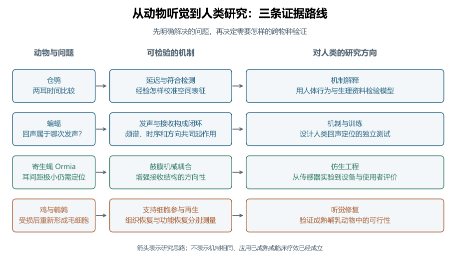
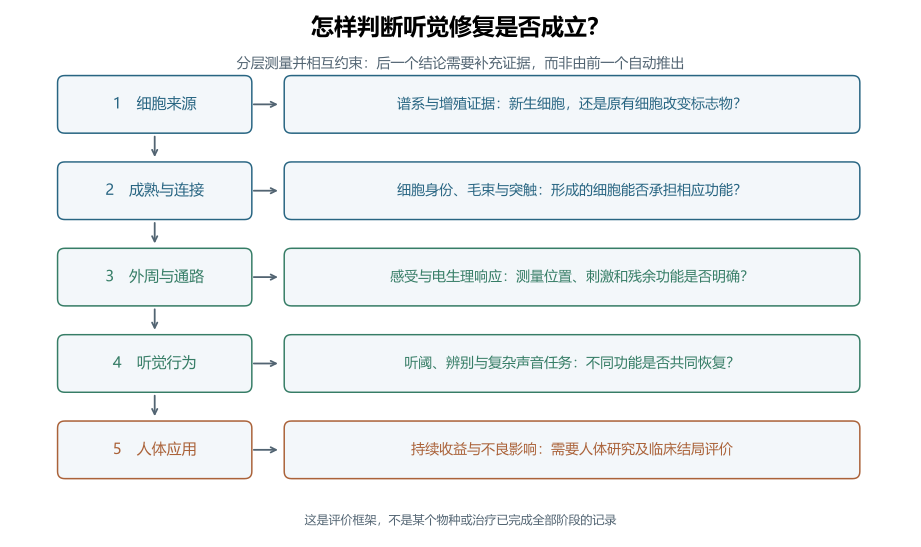
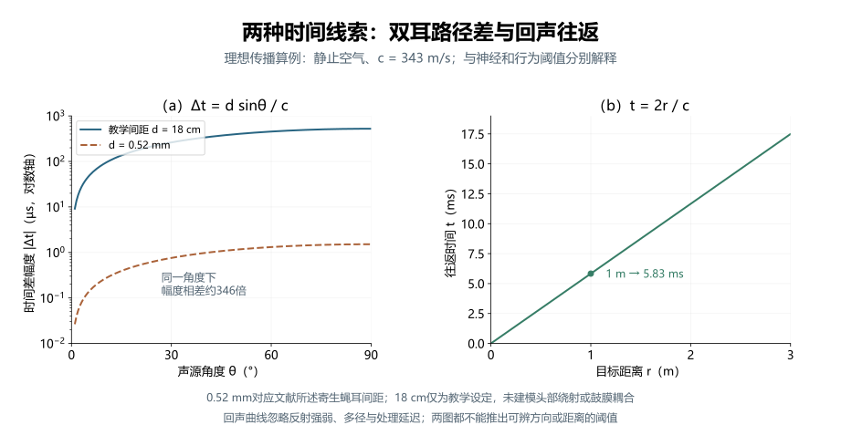

# 比较听觉

> 动物听觉对人类听觉研究的启示 · 深度词条 · 2026-10-10 · Draft，尚未完成专业审阅

**比较听觉**（comparative hearing）是通过比较不同物种的听觉结构、声学输入、神经处理与行为，研究听觉系统怎样解决共同问题、又怎样适应不同生活环境的研究取向。动物听觉为人类研究提供可检验的机制、不同的实现方式与功能边界：两耳怎样比较时间，主动发声怎样帮助感知环境，极小接收结构怎样获得方向性，受损感受细胞又能否重新形成。[1](#ref-comp-konishi-2000)

本词条以“动物听觉对人类听觉研究的启示”为主线，先概览常用动物模型，再展开仓鸮、蝙蝠、寄生蝇 *Ormia ochracea* 和鸟类毛细胞再生四组案例，并以哺乳动物和人体研究作为对照。比较的重点是问题、机制与证据之间的联系。某种动物完成特定任务的能力很强，不等于它在所有听觉任务中都优于人类；发现可行机制，也还需要人体资料才能判断它是否解释人类感知。[1](#ref-comp-konishi-2000)[3](#ref-comp-mcalpine-2001)

这些启示可以沿三条路线进入应用。基础研究用动物实验检验人类听觉模型；仿生工程提取动物结构或计算的设计原理；听觉修复研究则比较再生能力及其限制。三条路线需要的后续证据不同，不能把动物神经元的响应、实验室器件的方向性或细胞标志物变化，合并成同一种“人类听力改善”。

## 比较的对象与研究范围

### 从共同任务出发

同一个定位问题可以在不同身体尺度、频率范围与环境中出现。仓鸮需要利用双耳线索确定声源方向，寄生蝇也需要定位声音，但极小耳间距限制了原始声学差异。比较这两类系统，可以把“外界提供多少线索”和“接收结构及神经系统怎样利用线索”分别提出。[2](#ref-comp-carr-1990)[9](#ref-comp-robert-1996)

另一类比较围绕主动感知：动物先改变自己的发声，再利用接收到的回声决定下一步行为。蝙蝠研究能帮助提出回声归属和干扰抑制的问题；人体训练研究则直接检验人类能否学习利用自发点击声的反射。两者共享“行动改变输入”的研究框架，具体频段、声源、接收结构和训练任务仍需分别记录。[6](#ref-comp-ming-2020)[8](#ref-comp-norman-2021)

比较听觉还包括系统受损后的变化。鸡和鹌鹑的研究把毛细胞损失与随后出现的新细胞联系起来；成熟小鼠实验则检验是否可以改变支持细胞的命运。这里比较的是修复过程及其限制，不能只比较治疗前后某个听阈数值。[12](#ref-comp-corwin-1988)[13](#ref-comp-ryals-1988)[16](#ref-comp-gunewardene-2025)

### 机制解释、模型动物与仿生设计

**模型动物研究**利用某个物种观察或操纵人类难以直接研究的过程；**比较研究**进一步询问这些过程在不同物种中有哪些共性与差异；**仿生听觉**把其中可提取的原理转成工程结构或算法。同一项动物研究可能启发多个方向，但每个方向都有自己的验证对象。

例如，寄生蝇鼓膜耦合支持一种获得方向性的物理机制。工程人员可以借鉴耦合结构设计微型传感器，而不需要复制昆虫的全部神经系统。要判断这样的传感器是否适合[助听器](https://betterci.github.io/n3-hearingpedia/concepts/hearing-aid/)，还应考察其带宽、噪声、设备集成与使用者表现；这些问题超出了昆虫鼓膜实验本身的结论。[9](#ref-comp-robert-1996)[10](#ref-comp-wilmott-2016)

<figure class="encyclopedia-figure">

<figcaption><strong>图1　动物听觉启示的三条路线。</strong> 根据正文案例独立绘制的概念图。框与箭头组织研究问题及验证方向，不表示物种之间机制完全相同，也不表示某项人体应用已经实现。</figcaption>
</figure>

## 听觉研究中的常用动物模型

### 不同动物适合回答哪些问题

听觉研究既使用小鼠、大鼠等常规实验动物，也使用仓鸮、蝙蝠等具有特定听觉适应的动物。前者便于围绕遗传、损伤和干预建立可重复的模型，后者能突出定位、主动感知或再生中的某个机制。模型的价值取决于研究问题：与人类亲缘更近、听阈更相似，或某项能力更强，都不足以单独决定模型是否合适。[1](#ref-comp-konishi-2000)[18](#ref-comp-ohlemiller-2016)

下表列出代表性研究对象与用途。它是选择研究入口的概览，并非所有物种的完整清单；同一物种也可以服务于多种问题。

| 动物模型 | 代表性研究用途与优势 | 比较或外推时要注意什么 |
| --- | --- | --- |
| **小鼠** | 遗传性听力损失、耳蜗发育、年龄相关损伤及细胞命运操纵；遗传资源有助于检验基因与表型的因果联系。[18](#ref-comp-ohlemiller-2016) | 品系、基因背景与年龄影响基线听力和损伤易感性；小鼠的频率范围不能直接代表人类言语听觉。 |
| **大鼠** | 噪声、药物与年龄相关感音神经性听力损失研究，是常用啮齿类模型之一。[19](#ref-comp-rodents-2024) | 需要区分耳蜗损伤、中枢响应与行为评价；疾病模型的结果应按具体诱导方式和测量终点解释。 |
| **豚鼠** | 耳蜗与听觉通路生理、获得性听力损失；本词条的低频双耳编码对照来自豚鼠下丘记录。[3](#ref-comp-mcalpine-2001)[19](#ref-comp-rodents-2024) | 某个脑区的ITD调谐支持机制解释，还需要人类行为或生理证据检验其适用范围。 |
| **蒙古沙鼠** | 哺乳动物听觉生理及感音神经性听力损失研究，补充小鼠、大鼠之外的物种比较。[19](#ref-comp-rodents-2024) | 比较应匹配频段、发育阶段与损伤类型，不能将不同啮齿类的参数直接互换。 |
| **南美栗鼠（chinchilla，俗称龙猫）** | 听觉检测与辨别、耳蜗生理、噪声损伤；可在同一物种联系行为、结构与生理，听力图与人类有较大重叠。[20](#ref-comp-chinchilla-2019) | 频率范围重叠不等于损伤剂量或恢复过程相同，也不表示动物具有人的言语理解能力。 |
| **猫** | 人工耳蜗电刺激与发育可塑性的经典模型；例如新生期致聋猫的慢性刺激研究考察了下丘表征变化。[21](#ref-comp-snyder-1990) | 电刺激引起的神经表征变化不能直接换算为儿童植入后的言语与语言发展。 |
| **鸟类：鸡、鹌鹑、仓鸮与斑胸草雀** | 鸡、鹌鹑用于毛细胞再生；仓鸮用于双耳定位；斑胸草雀用于听觉反馈与学习性鸣唱的维持和可塑性。[2](#ref-comp-carr-1990)[12](#ref-comp-corwin-1988)[13](#ref-comp-ryals-1988)[22](#ref-comp-brainard-2000) | “鸟类模型”不是单一模型；再生、空间定位和鸣唱学习涉及不同物种、结构与任务，鸣唱也不能等同于人类语言。 |
| **蝙蝠** | 主动回声定位、发射与接收的协调、回声归属与干扰；可结合行为和计算模型研究。[6](#ref-comp-ming-2020)[7](#ref-comp-beleyur-2019) | 回声定位物种的发声与接收特性需要逐项注明，不能推广到所有蝙蝠或人的被动聆听。 |
| **斑马鱼** | 毛细胞损伤的遗传与药物筛选；幼鱼侧线毛细胞易于观察，可用于发现保护机制与候选化合物。[24](#ref-comp-owens-2008) | **侧线感受水体运动，不能作为内耳听觉的同义词**；侧线细胞存活结果需要另行验证内耳、哺乳动物和听觉功能。 |
| **昆虫：果蝇与寄生蝇** | 果蝇用于听觉机械感受的遗传筛选；寄生蝇 *Ormia* 用于鼓膜耦合与仿生方向传感。[25](#ref-comp-eberl-1997)[9](#ref-comp-robert-1996) | 果蝇触角感受器与寄生蝇鼓膜是不同结构；基因或力学原理的启示不表示昆虫具有哺乳动物耳蜗。 |
| **非人灵长类：以普通绒猴为例** | 听觉皮层表征研究；绒猴实验发现了对纯音及相应缺失基频复合音响应的音高选择性神经元。[23](#ref-comp-bendor-2005) | 音高神经响应不等于人类音乐或语言体验；即便亲缘较近，仍须核对任务、声学线索和脑区对应关系。 |

### 从物种名称到具体模型

“使用小鼠”还不是充分的模型说明。至少需要注明**物种与品系、基因型、年龄、基线听力、损伤或干预方式，以及测量任务和终点**。例如，遗传性听力损失模型与噪声损伤模型即使使用同一物种，也未必具有相同病理过程；具有年龄相关听力变化的品系，又会影响对训练或治疗前后差异的解释。[18](#ref-comp-ohlemiller-2016)[19](#ref-comp-rodents-2024)

选择模型时，可以先问目标结论处于哪一层：基因或细胞机制、神经编码、行为表现，还是人类应用。遗传筛选、单元记录与行为任务各自回答不同问题，不能互相替代。若要将发现用于人类，可以通过跨物种验证连接这些层次：先验证可重复的机制，再检验相应听觉功能，最后在对应的人群与任务中评价收益。这样，常规模型提供的可操纵性与特殊动物提供的机制启示便能形成互补。

## 仓鸮：双耳时间差怎样成为定位信息

### 延迟线与符合检测的实验依据

声源偏向一侧时，声音到达两耳的路径可以不同，由此产生[耳间时间差](https://betterci.github.io/n3-hearingpedia/concepts/interaural-time-difference/)（ITD）。计算这一差异，需要把两耳输入的时间关系转换为神经活动。Carr和Konishi在1990年的仓鸮脑干研究中，把解剖连接、传导时序和双耳响应结合起来：进入层状核的输入具有系统性的到达时间变化，层状核神经元在两侧输入接近同时到达时响应更强。[2](#ref-comp-carr-1990)

这个结果为[Jeffress模型](https://betterci.github.io/n3-hearingpedia/concepts/lloyd-jeffress/)中的“内部延迟补偿外部时间差”和“符合检测”提供了具体神经证据。若一个单元的左右输入具有不同内部延迟，那么某个外部ITD可以使两路信号在该单元相遇。不同单元偏好不同时间关系，便有可能形成可读出的时间差表征。[2](#ref-comp-carr-1990)

这一实验的启示是把抽象计算分成可测环节。传导时间变化支持延迟机制，双耳输入条件下的响应支持符合检测，空间调谐的排列又涉及输出怎样被读取。这些证据回答不同问题；仅画出一个延迟线示意图，不能证明某个人类脑区已经采用相同回路。

### 哺乳动物对照改变了什么

McAlpine等在2001年的豚鼠下丘研究中发现，神经元最佳频率与偏好时间差之间存在系统关系，响应曲线较陡的区域接近中线。这些结果支持通过两个较宽的半球通道活动读出低频定位信息的解释，而非要求每个方向都有一个独立的最佳响应位置。[3](#ref-comp-mcalpine-2001)

这并不取消精确时间比较。符合检测描述两耳输入怎样产生时间敏感性，位置编码或群体通道描述下游怎样读取敏感性；不同层级可以有不同实现。比较听觉因此帮助人类研究识别模型中的哪些成分值得保留，哪些解剖假设需要重新检验。

Encke和Dietz在2022年把双通道框架转为数学模型，并与既有的人类双耳去掩蔽行为资料比较。这提供了从动物生理思路到人体行为预测的一条路径，但模型解释行为资料的成功，仍不能单独确定人类神经回路的唯一实现；去掩蔽任务也需要与声源定位任务分别解释。[17](#ref-comp-encke-2022)

### 经验怎样校准空间表征

定位系统还需要适应发育和输入变化。Knudsen和Brainard用改变视觉方向的棱镜饲养仓鸮，观察到发育中的听觉空间调谐向改变后的视觉位置调整。这使“视觉经验能够校准听觉空间表征”成为可以实验操纵的假设，而非仅靠两种感觉活动相关来推断。[4](#ref-comp-knudsen-1991)

Shadron和Peña在2023年的研究进一步改变发育期间的面盘羽毛结构，考察空间线索可靠性与中脑频率调谐的关系。所记录的调谐变化与输入可靠性的变化相一致，为经验怎样塑造线索权重提供了证据。[5](#ref-comp-shadron-2023)

对人类的研究启示是：评价[听觉可塑性](https://betterci.github.io/n3-hearingpedia/concepts/auditory-plasticity/)时，可以同时测量输入线索、学习过程与行为迁移。动物发育实验中的适应，不能直接当作成人训练或人工耳蜗康复的收益；后者应在对应的人群和任务中验证。

## 蝙蝠：主动发声怎样组织回声信息

### 发声、传播与接收形成闭环

回声定位的基本过程是发出声音，接收目标反射，利用延迟、频谱等信息判断环境。与听一个独立外部声源相比，主动发声提供了可参考的发射事件，也使声音的时序和形式成为感知系统可以调整的变量。理解这一过程，需要同时研究发射、[声传播](https://betterci.github.io/n3-hearingpedia/concepts/sound-waves-and-propagation/)、接收与后续行为。[6](#ref-comp-ming-2020)

在静止空气、同一位置发射和接收、单个静止目标的理想条件下，往返时间 $t$ 与距离 $r$ 满足：

$$
t=\frac{2r}{c},\qquad r=\frac{ct}{2}.
$$

其中 $t$ 的单位为s，$r$为m，$c$为m/s，因声音需要往返而出现系数2。这个几何关系只给出传播延迟，不包括反射强弱、目标形状、接收方向性、神经处理和多径。算得一个距离对应的回声时间，还不能证明动物或人能够辨别该距离。

### 回声归属与多声源干扰

当下一次发声已经发生、上一次的远处回声仍在返回时，接收系统必须判断每个回声属于哪次发射。Ming等在2020年的大棕蝠研究中结合行为证据与听觉模型，考察频率跳变及最低频率成分如何参与区分相互重叠的回声流。这支持利用发射与回声的频谱关系缓解归属歧义的解释。[6](#ref-comp-ming-2020)

多个个体同时发声还会带来[掩蔽](https://betterci.github.io/n3-hearingpedia/concepts/masking/)。Beleyur和Goerlitz在2019年建立结合发声、传播、心理声学和群体几何的模型，估计群飞中的回声检测机会。模型显示，能获得哪些邻近个体的信息受空间位置与发声条件共同影响；它描述的是有参数约束的预测，不是逐只动物在自然群飞中报告的感知结果。[7](#ref-comp-beleyur-2019)

这两类研究让工程设计有了更具体的提问方式：在输入端能否减少歧义，发射时序能否提高目标与干扰的分离，接收方向性又怎样改变可用信息。若把原理用于人类辅助设备，还应在实际声场中比较延迟、可听度和任务成绩，不能只把某个蝙蝠模型的输出称为语音理解改善。

### 人类回声定位需要自己的证据

Norman等在2021年研究自发点击声的回声定位训练。14名有视力参与者和12名盲人参与者在10周内完成20次训练，并接受实物或虚拟环境任务评价；研究观察到两组多项表现改善，也安排了新任务测试和盲人参与者随访。[8](#ref-comp-norman-2021)

这说明人类可以学习利用反射声完成相应任务，而不要求人类拥有蝙蝠的超声发声器官。两组年龄与听觉条件不同，训练涉及多个任务，随访又包含自述资料，因此研究不能确定所有人的收益相同，也不能把人类学习解释为复制了蝙蝠的全部神经机制。[8](#ref-comp-norman-2021)

在人类研究中，可以分别记录发声一致性、听力状态、训练反馈、未训练任务的迁移与保持时间。这样才能分辨进步来自更有效的发声、更熟悉任务，还是对回声线索的利用发生了变化。

## 寄生蝇：微小耳间距如何获得方向性

### 先检查原始声学线索的尺度

*Ormia ochracea* 的双侧鼓膜之间距离很小。Robert等在1996年的研究报告耳间距约520 μm，因此入射声产生的原始双耳时间差只有微秒量级。若仅按两个彼此独立的接收点理解，方向线索会非常小。[9](#ref-comp-robert-1996)

两个接收点在远场平面波中的理想路径差为 $d\sin\theta$，相应时间差为：

$$
\Delta t=\frac{d\sin\theta}{c}.
$$

其中 $d$为接收点间距，单位m；$\theta$以两点连线的垂直方向为零度，正角度按使右侧路径更长的方向定义；$\Delta t$为右侧减左侧的到达时间，单位s。公式忽略身体绕射和接收结构作用，描述外部路径几何，不是鼓膜运动模型。实际动物线索还受入射条件影响。

### 机械耦合改变接收端的响应

这两个鼓膜由结构连接，不能视为完全独立。激光测振显示，鼓膜运动具有明显方向性，机械响应中的两侧时间与幅度差大于原声场提供的差异。连接结构让两侧运动共同受到入射方向影响，从而改变随后可以送入神经系统的信息。[9](#ref-comp-robert-1996)

这里的启示发生在接收端：感知能力不仅依赖后续算法，也依赖声学信号进入系统时怎样被结构转换。鼓膜运动的时间差与原声场时间差应分别测量，机械增益也需要与频率响应、阻尼和噪声共同解释。某个条件下更大的机械差异，不等于所有频率和声场中的定位都更准确。

### 从耦合结构到传感器

Wilmott等在2016年制作并测量了借鉴耦合结构的窄带MEMS定向传感器。单个传感器具有余弦式方向响应及方向歧义；研究通过两个倾斜安装的传感器联合处理改善方向估计。它展示了可以制造并测试的器件路线，同时也说明仿生结构还需要处理读出与歧义。[10](#ref-comp-wilmott-2016)

Liu等在2025年提出低频多频带压电MEMS结构，利用有限元仿真分析其模态和方向响应。该文的相关结论属于仿真证据，不能写成已经完成实物测量或助听器使用者试验。[11](#ref-comp-liu-2025)

若面向助听器，可以把待验证目标分为传感器、系统与使用者三个层次。传感器层测方向响应、频响与自身噪声；系统层测封装、处理延迟和输出；使用者层测噪声中言语、定位与日常聆听。某种窄带共振结构适合特定测试频率，仍需解释它怎样覆盖宽带日常声音。

## 鸟类毛细胞再生：从细胞出现到功能恢复

### 再生的发现改变了什么问题

Corwin和Cotanche在1988年的鸡研究中报告声损伤后感受细胞被替代，并提出存活支持细胞分裂参与新细胞形成。同期Ryals和Rubel在成年鹌鹑中比较损伤后的细胞数量，并用标记的胸腺嘧啶核苷追踪DNA合成，为成年鸟类损伤后产生新毛细胞提供了证据。[12](#ref-comp-corwin-1988)[13](#ref-comp-ryals-1988)

这些发现把研究问题从“损失是否只能永久保留”推进到“什么细胞提供再生来源、什么条件启动再生”。Stone和Rubel进一步梳理了鸟类毛细胞再生的细胞与分子研究。比较听觉由此为[耳蜗](https://betterci.github.io/n3-hearingpedia/concepts/cochlea/)修复提供了自然发生的研究对象。[14](#ref-comp-stone-2000)

本案例讨论鸟类基底乳头的再生，人体应用则涉及哺乳动物Corti器中的细胞。本文把它们作为听觉感受上皮进行功能比较，不把鸟类毛细胞直接等同于人类[内毛细胞](https://betterci.github.io/n3-hearingpedia/concepts/inner-hair-cell/)或[外毛细胞](https://betterci.github.io/n3-hearingpedia/concepts/outer-hair-cell/)的完整功能配置。拟将某个细胞机制转到哺乳动物时，需要重新验证细胞身份、位置及相应功能。[14](#ref-comp-stone-2000)

### 怎样区分细胞、通路和行为结局

“毛细胞数量增加”是组织层的结果；“重新获得机械感受及合适连接”是细胞与通路功能；“听者更能辨别复杂声音”又是行为结局。再生评价需要建立它们之间的联系。Ryals等对鸟类功能研究的综述指出，听觉敏感性恢复与复杂声学知觉的恢复并非完全同步；即使纯音敏感性改善，部分复杂声音任务仍可留下变化。[15](#ref-comp-function-2013)

因此，比较再生后的功能时，不宜只用一个听阈代替全部听觉。可以同时考察纯音检测、频谱或时域辨别、物种相关叫声识别，以及后续学习。面对人类应用，这种分层思路还能连接[语音可懂度](https://betterci.github.io/n3-hearingpedia/concepts/speech-intelligibility/)与空间聆听，但具体指标应适合研究对象。

### 成熟哺乳动物实验中的限制

Gunewardene等在2025年的成年小鼠研究中，用病毒载体表达Atoh1、Pou4f3并干预Kdm1a，尝试同时改变支持细胞的遗传与表观遗传状态。研究观察到同时表达毛细胞和支持细胞标志物的细胞增加，但在所报告的治疗后时间点，处理组与对照组Myo阳性毛细胞数量没有显著差异。[16](#ref-comp-gunewardene-2025)

这一结果支持某些细胞状态发生改变，也显示递送和成熟再生仍有障碍。它不能支持“成年哺乳动物听力已经恢复”，更不能支持人体治疗有效。比较研究需要保留这些有限或阴性结果，才能判断鸟类提供的修复思路还缺少哪些环节。

<figure class="encyclopedia-figure">

<figcaption><strong>图2　听觉修复需要怎样的证据。</strong> 独立绘制的评价框架。细胞标志物、神经响应、听阈与复杂声音任务承担不同解释职责，箭头表示需要补充验证，不表示后续阶段自动成立，也不代表某项治疗已经完成全部阶段。</figcaption>
</figure>

## 分析示例：同样测时间，比较的却是不同线索

### 耳间距算例

设静止空气声速为343 m/s，声源位于理想接收点连线方向，即 $|\theta|=90^\circ$。使用文献所述寄生蝇耳间距 $d=0.00052$ m，几何时间差约为1.52 μs。另设 $d=0.18$ m作为大间距教学条件，时间差约为525 μs。两者相差约346倍；18 cm只是教学设定，不是人体耳间距的统一测量值。[9](#ref-comp-robert-1996)

这个计算帮助理解接收尺度为什么重要。它没有模拟寄生蝇鼓膜耦合，也没有模拟人头绕射，不能预测两个物种的定位阈值。真实昆虫实验中的入射声、鼓膜运动与神经响应又处在不同测量位置，原论文中的数值不能由这一几何式全部替代。

### 回声往返算例

同样使用343 m/s，距发射与接收点1 m的静止目标对应约5.83 ms的理想往返时间。双耳时间差比较的是**同一声源到两个接收点的差值**，回声时间比较的是**一次发射与其反射返回的间隔**。两者都以时间为单位，却需要不同的参考事件与物理模型。

实际回声是否可用还取决于反射能量与其他声源。若多个回声重叠，仅凭公式得到若干时间点，仍未解决它们对应哪个目标和哪次发声的问题。蝙蝠频谱归属研究与群体模型分别提供了考察这些问题的实验和计算路径。[6](#ref-comp-ming-2020)[7](#ref-comp-beleyur-2019)

<figure class="encyclopedia-figure">

<figcaption><strong>图3　双耳路径差与回声往返的理想计算。</strong> 左图绘制1°至90°的时间差绝对值，纵轴为对数标度；实线与虚线使用同一单位和纵轴，同一角度下幅度相差约346倍。零度时间差为零，未绘于对数轴。右图按t=2r/c计算。c=343 m/s，0.52 mm来自寄生蝇耳间距资料，18 cm为教学设定。两图均未使用动物、人体或器件实测数据。<a href="#ref-comp-robert-1996">[9]</a></figcaption>
</figure>

## 怎样设计有解释力的比较研究

### 确认两个实验是否测同一个问题

比较前先明确对象：检测声音、判断方向、分辨距离，还是识别复杂声源。不同任务的正确率不能直接排成听觉能力高低。自由场转头定位、耳机中的ITD辨别和细胞电生理记录，也没有自动共享的结果尺度。

刺激可以按物理单位对齐，例如频率、声压级与延迟；也可以根据各物种听觉条件选择相应刺激。两种设计回答不同问题。相同的频率或声级对不同物种未必具有相同可听度；经过头部和耳廓后的输入又可能不同。应报告刺激选择依据和接收位置，并把行为成绩与实际输入联系起来。

以定位为例，可以分别比较声场提供的ITD、单元调谐对ITD的敏感性和行为选择；以再生为例，可以分别比较损伤程度、细胞来源、后续功能和保持时间。这些是根据案例提炼的方法框架，具体步骤需由实验问题确定。

### 选择能够区分解释的控制

| 研究问题 | 关键比较 | 需要控制或另行记录 | 可以推进的解释 |
| --- | --- | --- | --- |
| 两耳时间如何被利用 | 单耳与双耳输入；不同ITD | 频率、声级、相位锁定与记录脑区 | 时间敏感性来自哪一处理环节 |
| 回声是否支持判断 | 发射声、反射声及其关系改变 | 目标、干扰、发声一致性与任务熟悉度 | 哪些回声线索参与行为 |
| 耦合是否产生方向性 | 独立接收与耦合响应 | 频率、角度、声场及噪声 | 接收结构怎样改变可用线索 |
| 是否发生功能性再生 | 损伤对照与干预；不同随访时点 | 残余细胞、标志物、细胞来源与功能任务 | 组织变化与功能改善如何联系 |

表中是研究设计的编辑性归纳，不是要求四类实验采用同一套流程。优先选择能区分替代解释的条件：例如，人体训练后正确率提高时，增加未训练任务可以考察迁移；毛细胞标志物增加时，补充细胞来源和成熟功能能缩小“仅改变表达状态”的解释空间。[8](#ref-comp-norman-2021)[16](#ref-comp-gunewardene-2025)

## 人类应用中的证据边界

### 从动物机制到人体解释

动物实验适合在解剖和生理层面提出机制，人类行为与非侵入记录适合检验可获得的预测。较完整的证据链应说明模型在动物中解释什么，在人体中预测什么，以及哪些模型也能产生类似结果。人体行为符合一种动物模型，是支持证据，仍需要考虑其他实现与不同任务。[1](#ref-comp-konishi-2000)[17](#ref-comp-encke-2022)

因此，仓鸮案例可以连接[双耳听觉](https://betterci.github.io/n3-hearingpedia/concepts/binaural-hearing/)、[相位锁定](https://betterci.github.io/n3-hearingpedia/concepts/phase-locking/)和[空间听觉](https://betterci.github.io/n3-hearingpedia/concepts/spatial-hearing/)，但不把仓鸮层状核当作人类脑干的逐结构模板。人类可用频段、群体活动读出和任务条件，需要由各自资料约束。

### 从工程响应到聆听收益

方向响应较强的接收器可能减少某些方向的输入，也可能改变目标声的频谱或幅度。评价应用应同时观察目标和干扰如何变化。对助听器与[人工耳蜗](https://betterci.github.io/n3-hearingpedia/concepts/cochlear-implant/)使用者而言，器件输出指标、定位和噪声中言语理解是不同结局，不能以一个指标代替所有功能。

仿生器件的成熟度也应逐项说明：计算仿真、制作测试、设备集成与使用者研究是不同阶段。2016年的窄带器件测量与2025年的多频带结构仿真各有贡献，后者的发表时间更近，并不自动表示其人体应用证据更强。[10](#ref-comp-wilmott-2016)[11](#ref-comp-liu-2025)

## 研究沿革与尚未解决的问题

这些案例展示了不同的发展线索：鸟类再生研究在1988年提供成年感受细胞更新的证据；仓鸮在1990年前后为双耳时间计算和空间校准提供可操纵的回路与经验模型；寄生蝇研究随后把方向性问题推进到接收结构的机械作用。后续哺乳动物比较、器件制作和人体训练，又分别检验原理在其他系统中的解释范围。[2](#ref-comp-carr-1990)[4](#ref-comp-knudsen-1991)[9](#ref-comp-robert-1996)[12](#ref-comp-corwin-1988)

本文检索截至2026年10月10日，结合经典研究与2021—2026年间可核验的相关发展，选取人体回声定位训练、双通道人体行为模型、仓鸮线索可靠性实验和2025年的器件仿真、成年小鼠重编程作为后续证据。这里呈现的是有明确范围的代表性路径，不是全部物种或全部当年论文的系统综述。

后续问题包括：哪些双耳计算成分在不同物种中相通，哪些群体读出依赖特定频段；主动感知训练的收益能否保持并迁移到日常环境；机械耦合怎样在小体积、宽带与低噪声之间取舍；再生细胞怎样获得稳定功能，并与复杂听觉行为相联系。解决这些问题，需要针对模型预测设计跨物种或跨阶段实验。

## 相关概念与复现入口

理解仓鸮案例可以从[耳间时间差](https://betterci.github.io/n3-hearingpedia/concepts/interaural-time-difference/)、[Jeffress模型](https://betterci.github.io/n3-hearingpedia/concepts/lloyd-jeffress/)和[相位锁定](https://betterci.github.io/n3-hearingpedia/concepts/phase-locking/)进入；蝙蝠与人体训练可连接[声波与传播](https://betterci.github.io/n3-hearingpedia/concepts/sound-waves-and-propagation/)、[室内声学](https://betterci.github.io/n3-hearingpedia/concepts/room-acoustics/)、[掩蔽](https://betterci.github.io/n3-hearingpedia/concepts/masking/)及[听觉场景分析](https://betterci.github.io/n3-hearingpedia/concepts/auditory-scene-analysis/)；寄生蝇连接[助听器](https://betterci.github.io/n3-hearingpedia/concepts/hearing-aid/)；再生案例连接[耳蜗](https://betterci.github.io/n3-hearingpedia/concepts/cochlea/)、[内毛细胞](https://betterci.github.io/n3-hearingpedia/concepts/inner-hair-cell/)、[外毛细胞](https://betterci.github.io/n3-hearingpedia/concepts/outer-hair-cell/)与[听力损失](https://betterci.github.io/n3-hearingpedia/concepts/hearing-loss/)。

图3的计算只需要给定声速、间距、方向和距离，再按正文公式生成曲线。配套[图形生成代码](assets/comparative-hearing/generate-comparative-hearing.py)公开参数及原创图示。它复现的是本文的教学计算，不是动物实验、人体训练或MEMS有限元研究。

群体回声检测模型另有作者发布的[代码归档](https://zenodo.org/records/3529691)，可作为查阅原研究方法的入口；本词条核验了归档与论文的关联，未运行该模型或声称复现论文结果。[7](#ref-comp-beleyur-2019)

## 参考文献与证据范围

[1] M. Konishi (2000). <a href="https://pubmed.ncbi.nlm.nih.gov/10989338/">Study of sound localization by owls and its relevance to humans</a>. Comparative Biochemistry and Physiology Part A: Molecular &amp; Integrative Physiology, 126(4), 459–469。访问范围：abstract。阅读PubMed摘要与书目；支持动物模型外推问题、仓鸮与人类定位比较的背景；不把综述的机制观点视作人体回路直接记录。

[2] Carr CE, Konishi M. (1990). <a href="https://pubmed.ncbi.nlm.nih.gov/2213141/">A circuit for detection of interaural time differences in the brain stem of the barn owl</a>. The Journal of neuroscience : the official journal of the Society for Neuroscience, 10(10), 3227-3246。访问范围：abstract。阅读原研究摘要，核对仓鸮层状核输入时序、延迟线与符合检测证据；正文不报告摘要以外的刺激参数或逐图结果。

[3] McAlpine D, Jiang D, Palmer AR. (2001). <a href="https://pubmed.ncbi.nlm.nih.gov/11276230/">A neural code for low-frequency sound localization in mammals</a>. Nature neuroscience, 4(4), 396-401。访问范围：abstract。阅读PubMed原研究摘要并核对物种索引；支持豚鼠下丘最佳频率、ITD调谐斜率及双通道读出解释；不是人体生理证据。

[4] Knudsen EI, Brainard MS. (1991). <a href="https://pubmed.ncbi.nlm.nih.gov/2063209/">Visual instruction of the neural map of auditory space in the developing optic tectum</a>. Science (New York, N.Y.), 253(5015), 85-87。访问范围：abstract。阅读原研究摘要；核对棱镜改变发育仓鸮视觉经验后听觉空间调谐改变；不外推成人康复疗效。

[5] Shadron K, Peña JL. (2023). <a href="https://pmc.ncbi.nlm.nih.gov/articles/PMC10238092/">Development of frequency tuning shaped by spatial cue reliability in the barn owl's auditory midbrain</a>. eLife, 12, e84760。访问范围：fulltext。阅读摘要及欧洲PMC全文相关引言、结果与讨论，核对发育期面盘处理、ITD可靠性与频率调谐关系；未重新分析单元记录。

[6] Ming C, Bates ME, Simmons JA. (2020). <a href="https://pubmed.ncbi.nlm.nih.gov/32632013/">How frequency hopping suppresses pulse-echo ambiguity in bat biosonar</a>. Proceedings of the National Academy of Sciences of the United States of America, 117(29), 17288-17295。访问范围：abstract。阅读原研究摘要与出版社公开Significance；核对大棕蝠、最低FM1频率与脉冲回声归属的行为及模型解释；全文XML访问失败，未核对完整实验方法或运行SCAT模型。

[7] Beleyur T, Goerlitz HR. (2019). <a href="https://pubmed.ncbi.nlm.nih.gov/31822613/">Modeling active sensing reveals echo detection even in large groups of bats</a>. Proceedings of the National Academy of Sciences of the United States of America, 116(52), 26662-26668。访问范围：abstract。阅读原研究摘要并核对作者代码归档；支持有生物参数约束的群体回声检测模型及空间限制；不能作为自然群飞逐只感知测量，未运行代码。

[8] Norman LJ, Dodsworth C, Foresteire D, Thaler L. (2021). <a href="https://pmc.ncbi.nlm.nih.gov/articles/PMC8171922/">Human click-based echolocation: Effects of blindness and age, and real-life implications in a 10-week training program</a>. PloS one, 16(6), e0252330。访问范围：fulltext。阅读摘要、方法中参与者与训练任务、相关结果和讨论；核对14名有视力与12名盲人参与者、10周20次训练、迁移及自述随访限制；没有重分析数据。

[9] Robert D, Miles RN, Hoy RR. (1996). <a href="https://pubmed.ncbi.nlm.nih.gov/8965258/">Directional hearing by mechanical coupling in the parasitoid fly Ormia ochracea</a>. Journal of comparative physiology. A, Sensory, neural, and behavioral physiology, 179(1), 29-44。访问范围：abstract。阅读原研究摘要；核对520 μm耳间距、鼓膜耦合、激光测振与机械响应中的方向线索增强。几何算例为独立计算，未作为原文实测数值。

[10] Wilmott D, Alves F, Karunasiri G. (2016). <a href="https://pmc.ncbi.nlm.nih.gov/articles/PMC4954978/">Bio-Inspired Miniature Direction Finding Acoustic Sensor</a>. Scientific reports, 6, 29957。访问范围：fulltext。阅读摘要及全文器件结构、方向响应与实验相关段落；支持窄带MEMS传感器实物测量、余弦方向歧义和双传感器组合；没有助听器使用者试验。

[11] Liu Y, Zhao L, Ding X. (2025). <a href="https://pmc.ncbi.nlm.nih.gov/articles/PMC12029790/">A Low-Frequency Multi-Band Piezoelectric MEMS Acoustic Sensor Inspired by Ormia ochracea</a>. Micromachines, 16(4), 451。访问范围：fulltext。阅读全文摘要、机械分析、仿真结果和结论；相关性能属于有限元仿真，不是已制作器件测量或人体应用证据。

[12] Corwin JT, Cotanche DA. (1988). <a href="https://pubmed.ncbi.nlm.nih.gov/3381100/">Regeneration of sensory hair cells after acoustic trauma</a>. Science (New York, N.Y.), 240(4860), 1772-1774。访问范围：abstract。阅读原研究摘要；核对鸡声损伤后感受细胞替代及支持细胞分裂的解释；未据此宣称已证明人体功能恢复。

[13] Ryals BM, Rubel EW. (1988). <a href="https://pubmed.ncbi.nlm.nih.gov/3381101/">Hair cell regeneration after acoustic trauma in adult Coturnix quail</a>. Science (New York, N.Y.), 240(4860), 1774-1776。访问范围：abstract。阅读原研究摘要；核对成年鹌鹑损伤后细胞数量与标记胸腺嘧啶核苷的再生证据；正文不报告摘要之外的暴露参数。

[14] Stone JS, Rubel EW. (2000). <a href="https://depts.washington.edu/rubelab/personnel/Stone%2C%20Rubel%2C%20PNAC%2000.pdf">Cellular studies of auditory hair cell regeneration in birds</a>. Proceedings of the National Academy of Sciences of the United States of America, 97(22), 11714-11721。访问范围：fulltext。XML访问失败后阅读作者机构公开PDF的摘要、支持细胞来源及细胞分化相关段落；支持鸟类再生研究范围、来源及成熟与连接需要分层考察；未逐项复核综述引用的原始数据。

[15] Ryals BM, Dent ML, Dooling RJ. (2013). <a href="https://pubmed.ncbi.nlm.nih.gov/23202051/">Return of function after hair cell regeneration</a>. Hearing research, 297, 113-120。访问范围：abstract。阅读原文摘要；支持鸟类再生后纯音敏感性与复杂声学知觉恢复不完全同步；全文XML访问失败，未逐一核对该综述中的原始行为研究。

[16] Gunewardene N, Lam P, Song J, Nguyen T, Ruiz SM, Wong RCB, Wise AK, Richardson RT. (2025). <a href="https://pubmed.ncbi.nlm.nih.gov/39848037/">Extent of genetic and epigenetic factor reprogramming via a single viral vector construct in deaf adult mice</a>. Hearing research, 457, 109170。访问范围：abstract。阅读原研究摘要，核对成年小鼠Atoh1/Pou4f3/Kdm1a组合干预、双标志细胞变化及Myo阳性细胞数量未显著不同的有限结果；未宣称听觉恢复。

[17] Encke J, Dietz M. (2022). <a href="https://pmc.ncbi.nlm.nih.gov/articles/PMC9587988/">A hemispheric two-channel code accounts for binaural unmasking in humans</a>. Communications biology, 5(1), 1122。访问范围：fulltext。阅读摘要及全文模型、行为资料比较与讨论段落；支持双通道计算与既有人类双耳去掩蔽资料的拟合；不作为人体回路唯一实现的证明。

[18] Ohlemiller KK, Jones SM, Johnson KR. (2016). <a href="https://pubmed.ncbi.nlm.nih.gov/27752925/">Application of Mouse Models to Research in Hearing and Balance</a>. Journal of the Association for Research in Otolaryngology : JARO, 17(6), 493-523。访问范围：abstract。阅读作者综述摘要、PubMed图注与书目；支持小鼠遗传研究用途、品系及年龄影响与模型外推原则。全文XML访问失败，未逐项复核其引用的原始实验。

[19] Li W, Xu B, Huang Y, Wang X, Yu D. (2024). <a href="https://pubmed.ncbi.nlm.nih.gov/39442868/">Rodent models in sensorineural hearing loss research: A comprehensive review</a>. Life sciences, 358, 123156。访问范围：abstract。阅读综述摘要与书目；支持小鼠、大鼠、豚鼠、蒙古沙鼠及南美栗鼠属于常用感音神经性听力损失研究模型，及按问题选择模型的原则；不提供特定品系或损伤参数的选型结论。

[20] Trevino M, Lobarinas E, Maulden AC, Heinz MG. (2019). <a href="https://pmc.ncbi.nlm.nih.gov/articles/PMC6881193/">The chinchilla animal model for hearing science and noise-induced hearing loss</a>. The Journal of the Acoustical Society of America, 146(5), 3710。访问范围：fulltext。阅读作者综述全文中听力范围、行为研究、结构生理联系与总结相关段落；支持南美栗鼠模型用途及与人类听力范围重叠；没有逐项复核其引用的原始研究，不外推损伤剂量或言语理解。

[21] Snyder RL, Rebscher SJ, Cao KL, Leake PA, Kelly K. (1990). <a href="https://pubmed.ncbi.nlm.nih.gov/2076984/">Chronic intracochlear electrical stimulation in the neonatally deafened cat. I: Expansion of central representation</a>. Hearing research, 50(1-2), 7-33。访问范围：abstract。阅读原研究摘要与书目；支持新生期致聋猫、慢性耳蜗电刺激及下丘表征研究用途；不外推儿童植入后语言收益。

[22] Brainard MS, Doupe AJ. (2000). <a href="https://pubmed.ncbi.nlm.nih.gov/10783889/">Interruption of a basal ganglia-forebrain circuit prevents plasticity of learned vocalizations</a>. Nature, 404(6779), 762-766。访问范围：abstract。阅读原研究摘要与出版社书目；支持成年斑胸草雀听觉反馈、鸣唱维持及前脑回路可塑性研究；不将鸣唱等同于人类语言。

[23] Bendor D, Wang X. (2005). <a href="https://pubmed.ncbi.nlm.nih.gov/16121182/">The neuronal representation of pitch in primate auditory cortex</a>. Nature, 436(7054), 1161-1165。访问范围：abstract。阅读原研究摘要与书目；支持绒猴听觉皮层对纯音与同基频缺失基频复合音的音高选择性响应；全文XML失败，未引用未核验的刺激参数或等同人体主观体验。

[24] Owens KN, Santos F, Roberts B, Linbo T, Coffin AB, Knisely AJ, Simon JA, Rubel EW, Raible DW. (2008). <a href="https://pmc.ncbi.nlm.nih.gov/articles/PMC2265478/">Identification of genetic and chemical modulators of zebrafish mechanosensory hair cell death</a>. PLoS genetics, 4(2), e1000020。访问范围：fulltext。阅读PLOS原研究全文摘要、侧线结构、遗传与化合物筛选及哺乳动物验证相关结果；支持侧线毛细胞筛选用途，并区分水体运动感受、内耳听觉和人体功能；未运行筛选或重分析数据。

[25] Eberl DF, Duyk GM, Perrimon N. (1997). <a href="https://genepath.med.harvard.edu/perrimon/papers/eberlpnas.pdf">A genetic screen for mutations that disrupt an auditory response in Drosophila melanogaster</a>. Proceedings of the National Academy of Sciences of the United States of America, 94(26), 14837-14842。访问范围：fulltext。XML失败后阅读作者机构公开PDF的引言、听觉行为筛选与触角去除结果；支持果蝇听觉遗传筛选与触角感受结构；保留行为缺陷可能并非听觉特异的限制。

