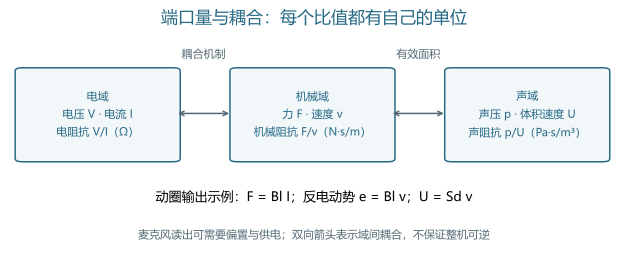
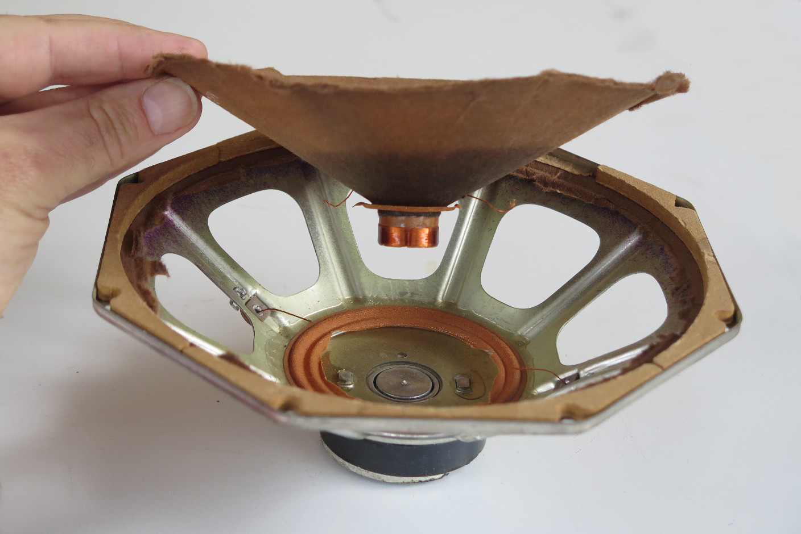
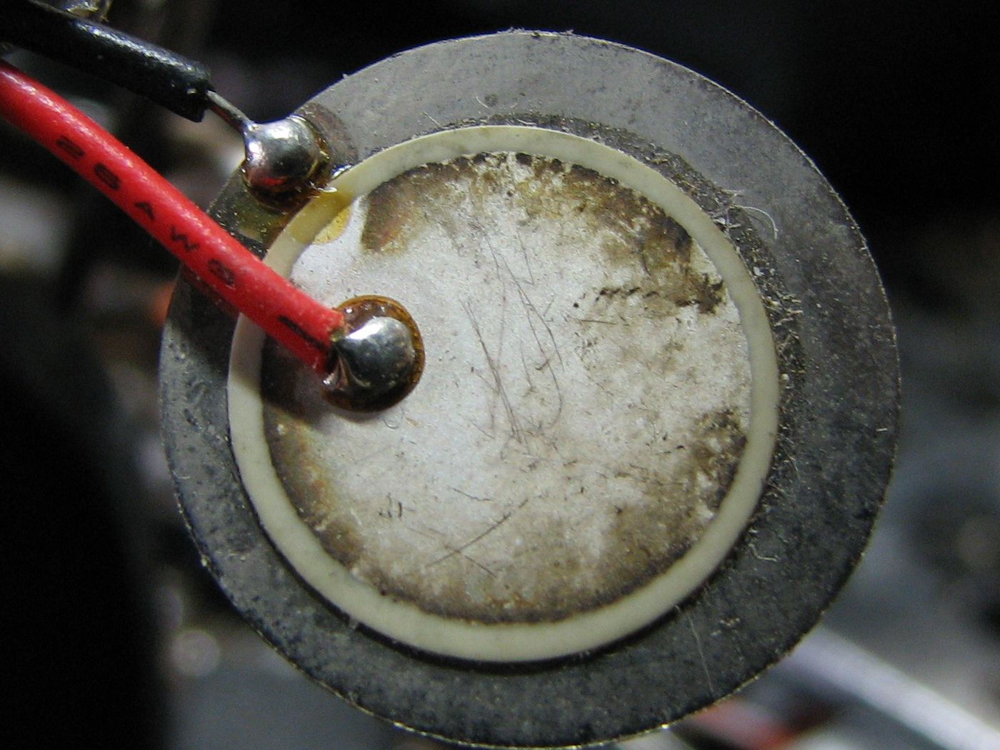
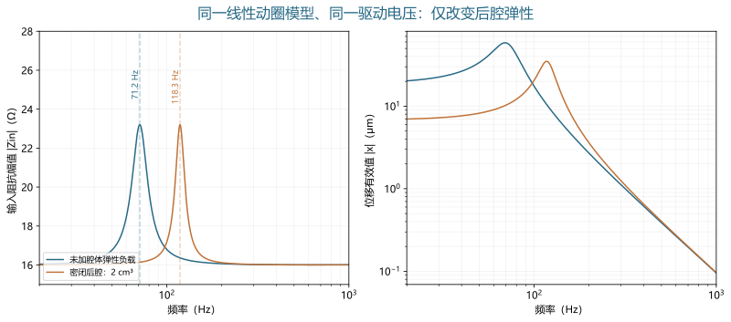
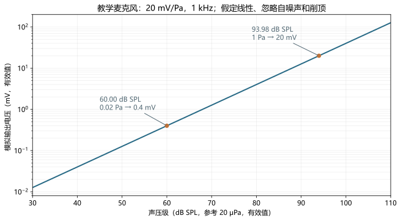
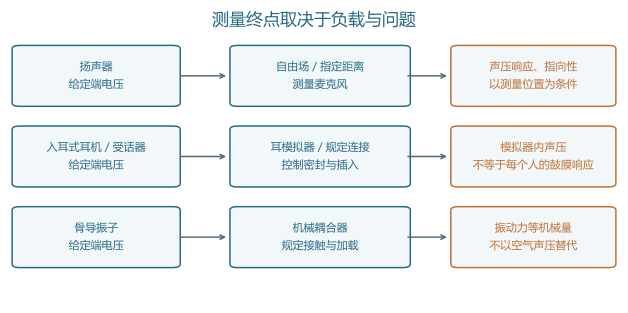

# 电声换能器

> 电、机械与声学端口的耦合及测量边界 · 深度词条 · 2026-10-10 · Draft，尚未完成专业审阅

**电声换能器**（electroacoustic transducer）是在电信号与声学信号之间建立物理转换的器件。麦克风把声学变化转为可读取的电信号；扬声器、耳机单元和助听器受话器把电驱动转为声音。许多常见结构通过振膜或其他运动部件连接电域与声域，因而理解换能过程需要同时考虑电路、机械运动和声学负载。[1](#ref-et-comsol-lumped)[3](#ref-et-ni-handbook)

听觉研究还使用骨导振子。它的主要输出经接触界面传入身体，评价时关注机械振动及加载条件。本词条将它作为与电声器件密切相关的电机械换能器讨论，避免把骨导输出当作空气中的声压。器件测量能够说明物理转换，却不能单独证明声音更自然、言语更清楚或临床获益更大。[9](#ref-et-iec60268-22)[14](#ref-audiometric-calibration-iec603186)

## 概念范围：器件、单元与系统

### 传感端与输出端

麦克风位于声学输入端，输出端则常称为扬声器、耳机驱动单元或受话器。这里“受话器”沿用听觉辅助设备的名称，指产生声输出的微型器件；它并不因为中文名称包含“受”字就成为声学接收传感器。同一种物理原理可以出现在不同角色中，例如动圈结构既可用于麦克风，也可用于扬声器。[3](#ref-et-ni-handbook)[19](#ref-nidcd-hearing-aids)

“换能单元”与“完整产品”也应区分。裸单元装入外壳后，前后腔、网罩、声管和连接件形成新的边界；完整耳机还包含放大、数字处理及佩戴界面。因此，某条响应曲线必须说明测的是单元、装配后的器件，还是从数字输入到声输出的整条链。输入端位置不同，即使名称相同，传递函数所包含的环节也不同。

### 换能、放大与信息处理

放大器主要改变电信号的幅度和驱动能力，滤波器改变电信号的频谱，换能器则跨越物理域。实际模块可以把三者集成在一起，但解释指标时仍需辨认其边界。某个数字麦克风的输出既包含机械敏感结构，也包含读出、增益和模数转换；其灵敏度不能直接当作裸振膜的物理转换系数。[6](#ref-et-adi-sensitivity)[7](#ref-et-adi-preamp)

对于需要供电的麦克风，输出电功率并不全部来自入射声波。声压使敏感结构发生微小变化，偏置与电子电路把这种变化读出来，供电可以承担输出信号的能量。因此，“检测很弱的声音”不要求传感器从弱声中获取足够大的输出功率。讨论转换方向时，应分别说明信息如何传递、能量由哪里提供。

## 三个物理域与端口变量

### 阻抗需要明确是哪一对量的比值

在线性稳态分析中，电域常用电压 $V$ 和电流 $I$，机械域用力 $F$ 和速度 $v$，集中参数声域用声压 $p$ 和体积速度 $U$。后者表示每秒通过某个截面的空气体积，单位为 $\mathrm{m^3/s}$，不是空气质点速度。各域阻抗可写为：

$$
Z_e=\frac{V}{I},\qquad Z_m=\frac{F}{v},\qquad Z_a=\frac{p}{U}.
$$

它们的单位分别是 $\Omega$、$\mathrm{N\,s/m}$ 和 $\mathrm{Pa\,s/m^3}$。在传播问题中也常见比声阻抗 $p/u$，其中 $u$ 是质点速度，单位为 $\mathrm{m/s}$。两种声学比值使用的变量不同，不能把数值直接代入同一个等效电路。阅读声管、腔体或辐射阻抗公式时，首先检查其端口定义，再检查几何面积是否已经包含在参数中。[1](#ref-et-comsol-lumped)

阻抗通常随频率变化，而且是复数。实部对应耗散，虚部反映储能；质量与弹性在不同频率范围内占据不同作用。直流电阻、某一频率下的阻抗幅值和厂家标称阻抗回答三个不同问题。仅用“这个单元是若干欧姆”不足以预测其全频段电流、机械运动和输出。

### 振膜面积连接机械域与声域

若振膜可近似为有效面积 $S_d$ 的刚性活塞，其法向速度为 $v$，则 $U=S_dv$。若作用于这一面的均匀压差为 $p$，相应力为 $F=S_dp$。于是，这一声学负载反映到机械域时成为 $S_d^2Z_a$。这是面积平方的来源，不是为了统一图形而任意加入的系数。

这一关系也给出模型边界：振膜不同部位存在明显振型差异，或者面上的压力分布不能视为均匀时，单一面积和速度就不足以描述整个器件。此时应考虑分布参数模型、模态模型或声固耦合计算。复杂模型是否必要，取决于频率范围、几何尺度和实际要预测的测量量。[2](#ref-et-comsol-driver)

<figure>
  
  <figcaption>图 1．三个域的端口定义。原创概念图；动圈关系适用于本文的小信号示例，双向箭头表示域间耦合，不表示所有带电子电路的成品都可反向使用。集中参数建模背景见 <a href="#ref-et-comsol-lumped">[1]</a>。</figcaption>
</figure>

## 主要转换原理与器件分类

### 分类应同时说明物理机制和结构

电声器件常按用途、尺寸、制造方式或转换机制分类。这些维度可以交叉：微型并不意味着电容式，MEMS 也不是一种独立的换能效应。下面列出代表性机制；不同结构的具体频响、噪声和最大输出需要在同一条件下测量，不能由名称直接排序。

| 机制或结构 | 关键物理过程 | 常见角色 | 阅读规格时应注意 |
| --- | --- | --- | --- |
| 动圈式 | 磁场中的线圈受电流驱动；运动也产生感应电动势 | 扬声器、耳机、部分麦克风 | 线圈与振膜运动、悬挂、阻抗及负载共同决定响应 |
| 平衡电枢式，俗称动铁 | 固定线圈改变磁作用，电枢运动经机械连接驱动振膜 | 微型受话器、部分入耳耳机 | 运动主体是电枢；不能套用“线圈随振膜一起运动”的图景 |
| 电容式／驻极体电容式 | 声压使振膜与背板间的电容变化，偏置和读出电路形成输出 | 测量麦克风、消费麦克风 | 驻极体提供极化，不等于内置电子电路无需供电 |
| 静电驱动 | 电场产生作用于敏感结构的力 | 部分声输出器件和微结构执行器 | 偏置、间隙及驱动幅度影响工作点，不能直接使用动圈力因子 |
| 压电式 | 应力产生电响应；电场产生应变 | 麦克风、微型扬声器及相关振动器件 | 材料、机械约束、读出或驱动电路决定有效转换 |

动圈和麦克风基础来自器件技术资料；平衡电枢的固定线圈结构由制造商资料核对，本文不采用其中的音质优越性宣传作为比较证据。[2](#ref-et-comsol-driver)[3](#ref-et-ni-handbook)[4](#ref-et-ni-measurement)[5](#ref-et-knowles-ba)

### 从实物观察结构与封装

图 2 把用途、机制与封装分开呈现：扬声器拆解展示运动结构；驻极体例子区分敏感胶囊和电子组件；MEMS照片展示封装与板级连接；压电圆片展示另一种执行结构。观察实物时，应把照片能显示的部件与需要原理图或测量才能判断的性质分开。

<figure>
  

    

      
      
<strong>a．动圈扬声器的拆解</strong>。拆开的扬声器：照片可见磁体、音圈与振膜。

      
Patrick.Nordmann / <a href="https://creativecommons.org/licenses/by-sa/4.0/">CC BY-SA 4.0</a> (via Wikimedia Commons) · <a href="https://commons.wikimedia.org/wiki/File:Lautsprecher_Aufbau.jpg">原图与来源</a> · 原图未修改。

    

    

      
      
<strong>b．驻极体胶囊与完整组件</strong>。左为MKE-3驻极体敏感胶囊，右为含缓冲放大器的完整麦克风组件。

      
Kae / <a href="https://creativecommons.org/licenses/by-sa/3.0/">CC BY-SA 3.0</a> (via Wikimedia Commons) · <a href="https://commons.wikimedia.org/wiki/File:Electret_microphone_MKE3.JPG">原图与来源</a> · 原图未修改。

    

    

      
      
<strong>c．MEMS数字麦克风封装</strong>。电路板上的Akustica AKU230 CMOS MEMS数字麦克风封装；内部敏感结构不可见。

      
© Raimond Spekking / <a href="https://creativecommons.org/licenses/by-sa/4.0/">CC BY-SA 4.0</a> (via Wikimedia Commons) · <a href="https://commons.wikimedia.org/wiki/File:Asus_Zenbook_UX32V_-_webcam_module_-_AK230_0539L_4911C-0108.jpg">原图与来源</a> · 原图未修改。

    

    

      
      
<strong>d．压电声输出元件</strong>。蜂鸣器中的金属圆片与压电片；用于观察压电结构，不代表宽带音频扬声器性能。

      
Gophi / <a href="https://creativecommons.org/licenses/by-sa/3.0/">CC BY-SA 3.0</a> (via Wikimedia Commons) · <a href="https://commons.wikimedia.org/wiki/File:2007-07-24_Piezoelectric_buzzer.jpg">原图与来源</a> · 原图未修改。

    

  

  <figcaption>图 2．四类器件的实物例子。照片按各自原始许可使用，完整保留原图，仅在页面中缩放显示；各图不是同一比例尺。外形和可见结构帮助识别器件，不能据照片判断带宽、灵敏度或音质。封装照片也不能直接展示MEMS内部工作机制。</figcaption>
</figure>

### MEMS 是制造与集成框架

MEMS 指微机电系统的结构与制造框架，其中可以实现电容检测、压电检测或多种驱动方式。把“MEMS 麦克风”和“电容麦克风”列为互斥类别，会掩盖不少 MEMS 麦克风本身使用电容机制的事实。数字输出则描述接口与信号链，不能据此推断敏感结构一定采用哪种机制。

微型化也不会自动消除机械限制。有限的位移、辐射面积、间隙和包装体积仍约束可获得的体积速度。研究新结构时，必须同时看敏感部分和其声学连接：芯片内部产生较大位移，不代表装入耳机后就能在目标频段得到足够声压。近期微型压电扬声器研究展示了结构设计、制造与负载建模之间的这种联系。[17](#ref-et-becker-2025)

## 动圈小信号模型：从端电压到运动

### 驱动力与反电动势共同进入方程

采用正弦稳态、$e^{j\omega t}$ 相量约定，并把各振幅按有效值理解。设线圈电阻为 $R_e$、电感为 $L_e$，力因子为 $Bl$，运动质量为 $m$，机械损耗为 $R_m$，悬挂刚度为 $K$。本文的线性教学模型写为：

$$
V=(R_e+j\omega L_e)I+Bl\,v,
$$

$$
\left(R_m+j\omega m+\frac{K}{j\omega}+S_d^2Z_a\right)v=Bl\,I.
$$

第一式中，$Bl\,v$ 是运动产生的反电动势；第二式中，$Bl\,I$ 是驱动力。$Bl$ 的单位可写为 $\mathrm{N/A}$，也等价于 $\mathrm{V\,s/m}$。机械运动因此会反过来影响电流，不能先把线圈当作固定电阻计算电流，再完全独立地求振膜运动。[1](#ref-et-comsol-lumped)

令括号中的总机械阻抗为 $Z_{m,\mathrm{tot}}$，则电输入阻抗为：

$$
Z_{\mathrm{in}}=R_e+j\omega L_e+\frac{(Bl)^2}{Z_{m,\mathrm{tot}}}.
$$

最后一项反映运动经耦合返回电端口的影响。它解释了为什么改变机械或声学负载，可以在电阻抗曲线上留下变化。这里把电感当作常数，是为了保留清晰的教学关系；真实器件还可能需要频率相关损耗、涡流、非活塞运动及更多声学支路。参数足够多并不保证模型可靠，仍需检验它能否预测独立的测量条件。

### 输入阻抗峰与位移峰不是同一件事

在只包含质量与刚度的未阻尼机械系统中，固有频率为 $f_0=\sqrt{K/m}/(2\pi)$。但实际驱动下的位移还取决于阻尼、反电动势以及恒电压或恒电流等条件。因而，机械固有频率、电阻抗幅值峰和恒电压位移最大值，不应不加区分地称为同一个“共振频率”。

这也影响实验解释。若某个频率下电输入阻抗增大，在恒端电压条件下电流可以减小；机械响应仍由完整耦合方程决定。只看电流变小就判断声输出一定变弱，或只看位移变大就判断远场声压一定同比增加，都会跳过声学辐射与测量位置这一环。

## 声学负载：腔体、声管与泄漏

### 一个可复算的密闭后腔例子

对于尺寸远小于波长、可视为压力均匀的密闭腔体，忽略泄漏与热黏性损耗，并采用绝热空气压缩近似，声顺为 $C_a=V_c/(\rho c^2)$。其负载阻抗为 $1/(j\omega C_a)$，反映到活塞振膜后相当于增加刚度：

$$
K_{\mathrm{air}}=\frac{\rho c^2 S_d^2}{V_c},\qquad
f_{0,\mathrm{cavity}}=\frac{1}{2\pi}\sqrt{\frac{K+K_{\mathrm{air}}}{m}}.
$$

以下全部是教学设定：$m=2\ \mathrm{g}$，$K=400\ \mathrm{N/m}$，$R_m=0.2\ \mathrm{N\,s/m}$，$Bl=1.2\ \mathrm{N/A}$，$R_e=16\ \Omega$，$L_e=0.1\ \mathrm{mH}$，$S_d=1\ \mathrm{cm^2}$；空气密度 $\rho=1.2\ \mathrm{kg/m^3}$，声速 $c=343\ \mathrm{m/s}$。两种条件都以 $0.1\ \mathrm{V_{rms}}$ 驱动，均忽略辐射负载，只比较是否增加后腔弹性。

未增加腔体弹性时，未阻尼机械固有频率约为 $71.18\ \mathrm{Hz}$。加入体积 $V_c=2\ \mathrm{cm^3}$ 的密闭后腔后，空气附加刚度约为 $705.89\ \mathrm{N/m}$，固有频率变为 $118.35\ \mathrm{Hz}$。图 3 按前述耦合方程直接求解，参数、代码和数值残差检查随图存档；它说明负载怎样改变同一模型，不预测任何实际产品。

<figure>
  
  <figcaption>图 3．原创解析示例，20–1000 Hz、同一端电压与同一组器件参数。虚线标出两种条件的未阻尼机械固有频率；右图的位移峰不必与虚线重合。基线忽略辐射负载，不能称为自由场实测。模型原则见 <a href="#ref-et-comsol-lumped">[1]</a>；计算假设与完整参数见正文。</figcaption>
</figure>

### 装配与佩戴为什么会改变结果

后腔主要影响振膜背面的负载，前腔、声管和耳塞则影响声音向外或向耳道传递的方式。短管可以在合适频率范围内用集中质量与损耗近似；当管长相对于波长不可忽略时，传播与驻波需要进入模型。单纯增加若干集总元件，未必能恢复已经超出近似范围的空间声场。

泄漏相当于额外的声学通路。若密闭前提被破坏，模型中的压力积累和低频输出就可能改变。对入耳器件，连接口、适配器和插入状态都是实验条件；对扬声器，箱体和障板也是系统的一部分。比较两条响应曲线前，应确认变化来自器件本身，还是来自连接、密封和测量位置。耳模拟器提供的是规定的声学负载与测量位置，不是每个真实耳朵的完整复制。[13](#ref-audiometric-calibration-iec603184)

## 灵敏度、声压级与效率

### 先读参考量，再比较分贝数

模拟麦克风的灵敏度可表示为输出电压与输入声压之比，例如 $20\ \mathrm{mV/Pa}$。其分贝表示以 $1\ \mathrm{V/Pa}$ 为参考；空气声压级采用 $20\ \mu\mathrm{Pa}$ 的参考声压。两者可写为：

$$
M_{\mathrm{dB}}=20\log_{10}\frac{|V/p|}{1\ \mathrm{V/Pa}},\qquad
L_p=20\log_{10}\frac{p_{\mathrm{rms}}}{20\ \mu\mathrm{Pa}}.
$$

设教学麦克风在 $1\ \mathrm{kHz}$ 的灵敏度为 $20\ \mathrm{mV/Pa}$，即约 $-33.98\ \mathrm{dB\ re\ 1\ V/Pa}$。在线性、忽略噪声和削顶的条件下，$60\ \mathrm{dB\ SPL}$ 对应 $0.02\ \mathrm{Pa_{rms}}$，产生 $0.4\ \mathrm{mV_{rms}}$；$1\ \mathrm{Pa_{rms}}$ 对应约 $93.98\ \mathrm{dB\ SPL}$，产生 $20\ \mathrm{mV_{rms}}$。这些是同一声压—电压映射，不是两个不同的增益阶段。[6](#ref-et-adi-sensitivity)

<figure>
  
  <figcaption>图 4．原创单位换算示例；纵轴为对数刻度，所有声压和电压均取有效值。曲线只表示假定的线性比例，不表示低声级端的真实信噪比或高声级端的实际线性极限。灵敏度定义背景见 <a href="#ref-et-adi-sensitivity">[6]</a>。</figcaption>
</figure>

数字麦克风常以 dBFS 表示给定声输入对应的数字输出。数字满量程与 $1\ \mathrm{V}$ 属于不同参考，峰值与有效值约定也可能不同。因此，不能直接用“−26 大于 −42”判断两种接口谁更灵敏。需先明确满量程定义、模拟增益与 ADC 输入范围，再把它们换算到可比较的声输入及输出量。[6](#ref-et-adi-sensitivity)

### 输出灵敏度与能量效率分别评价

扬声器的电压灵敏度可以描述指定频率、距离与方向上的 $p/V$，耳机则常在指定耦合装置中报告给定驱动对应的声压级。写出“若干 dB”而省略输入电压、输入功率或测量装置，会失去比较基础。例如 $2.83\ \mathrm{V_{rms}}$ 只在近似 $8\ \Omega$ 纯电阻上对应约 $1\ \mathrm{W}$；真实频变阻抗下，应根据电压、电流及相位计算有功输入。

效率比较的是输出功率与输入功率。采用有效值相量时，电有功输入为 $\operatorname{Re}\{VI^*\}$；声功率需要在指定表面上积分声强，不能用单个位置的声压平方直接代表所有辐射功率。封闭负载中的声压可以较高，同时净传输有功功率仍取决于声压与体积速度的相位。由此，较高的声压灵敏度不自动等于较高效率。[2](#ref-et-comsol-driver)

## 噪声、非线性与可用范围

### 弱声端与强声端受到不同约束

麦克风在弱输入下受机械热噪声、读出电路和后续电路噪声等限制。只看灵敏度无法知道安静条件下能否分辨目标声音；还要看噪声带宽、频率加权和等效输入噪声。若把输出噪声除以灵敏度换算回输入端，所用灵敏度与噪声谱必须对应同一频段和处理条件。前置放大器的选择也会改变系统噪声、输入负载及可用电压范围。[7](#ref-et-adi-preamp)

强输入端可能受到机械位移、间隙、供电和电子削顶限制。输出器件还可能随温升改变电阻与工作状态。因此，应将“某个频率的最大输出”“满足指定失真限值的输出”和“可持续承受的驱动”分别描述。短时信号与长期驱动不能仅凭峰值电压相同就视为等效，所关注的热和机械条件并不相同。

### 小信号模型不能预测所有大信号行为

前述常数模型意味着响应随输入幅度成比例，并且不会自行产生新频率。真实动圈器件的力因子、悬挂刚度或电感可能随运动及工作点变化，这属于大信号模型讨论的范围。IEC 62458 的公开范围将主要非线性参数及其测量作为专门问题；它没有把这种模型泛化为所有换能机制的统一表达。[10](#ref-et-iec62458)

对于单频输入，若输出基频和各谐波有效值分别为 $A_1,A_2,\ldots,A_N$，常用的基频归一化总谐波失真比为：

$$
\mathrm{THD}=\frac{\sqrt{\sum_{n=2}^{N}A_n^2}}{A_1}.
$$

报告百分数时乘以 $100\%$。必须注明测试频率、输出或驱动幅度、纳入的谐波阶数和带宽，并检查仪器采用的分母约定。THD+N 还包含测量带宽内的噪声等成分；低输入时，噪声占比增大可能让 THD+N 上升，不能把整条曲线都解释成机械非线性加重。

线性均衡可以改变输入频谱，从而避开较大的共振驱动或改变输出水平，但它不会凭空获得一个准确的非线性逆模型。研究中观察到均衡后 THD 降低，还应检查是否同时降低了某些频率的声输出。物理失真指标与听感、可懂度之间也需要另行设计实验，不能用单一失真比例替代听觉评价。[18](#ref-et-massi-2025)

## 测量链与标准的适用范围

### 先确定测什么，再选择装置

一条可解释的测量链需要明确刺激、输入参考端、器件与负载、输出参考位置，以及采集与分析处理。测扬声器时可在指定声场、距离和角度读取声压；测入耳输出时，应记录耦合器或耳模拟器与连接条件；测骨导输出时，则关注规定机械负载上的振动响应。设备名称相同并不意味着三种测量可以共用声压参考。

对接收器件，还需分辨压力场、自由场或扩散场条件与相应修正。声场和麦克风几何影响高频测量，电输出必须经过已知灵敏度和信号链转换，才能追溯到声学量。对一个标称为“平直”的麦克风，也应询问平直响应适用于什么声场，而不是直接在任意安装条件下使用。[4](#ref-et-ni-measurement)

<figure>
  
  <figcaption>图 5．原创测量负载示意。每一行都是一个问题与装置的组合，不表示装置之间可以相互替代。声输出、入耳负载和骨导耦合的适用范围分别参见 <a href="#ref-et-iec60268-21">[8]</a>、<a href="#ref-audiometric-calibration-iec603184">[13]</a>、<a href="#ref-audiometric-calibration-iec603186">[14]</a>。</figcaption>
</figure>

### 按问题选择标准，而非只写“按 IEC 测试”

| 要评价的问题 | 相关标准与公开范围 | 本词条据此作出的区分 |
| --- | --- | --- |
| 电输入到声输出的传递 | IEC 60268-21:2018，输出为基础的声学测量 | 声输出物理测量与知觉评价分开 |
| 电端口和机械运动 | IEC 60268-22:2020，换能器电与机械测量 | 可以分别检查电阻抗、运动及相关边界条件 |
| 扬声器等器件的大信号参数 | IEC 62458:2010 | 力因子、刚度、电感等非线性需要专门表征 |
| 声系统用麦克风 | IEC 60268-4:2018 | 包括灵敏度、指向性和动态范围等；范围不含测量麦克风 |
| 普通耳机与耳塞 | IEC 60268-7:2025 | 范围排除测听耳机及助听器受话器等，不覆盖所有入耳设备 |
| 入耳连接的规定声学负载 | IEC 60318-4:2010 | 耳模拟器规范与待测产品的性能规范不同 |
| 骨导振子的规定机械负载 | IEC 60318-6:2007 | 使用机械耦合器，不能用空气声压输出替代 |
| 气导助听器的电声特性 | IEC 60118-0:2022 | 耦合器或耳模拟器测量与真实耳内效果分开 |
| 实验室标准麦克风的互易压力校准 | IEC 61094-2:2009，及 2022 年修订 | 互易法具有器件和方法条件，不表示任意消费麦克风都可反向校准 |

上述范围分别依据官方公开目录核对。[8](#ref-et-iec60268-21)[9](#ref-et-iec60268-22)[10](#ref-et-iec62458)[11](#ref-et-iec60268-4)[12](#ref-et-iec60268-7)[13](#ref-audiometric-calibration-iec603184)[14](#ref-audiometric-calibration-iec603186)[15](#ref-et-iec60118-0)[16](#ref-et-iec61094-2)

这里没有获得完整付费标准，不据目录转录容差、操作条款或认证要求。范围排除意味着应寻找对应规范，不意味着某种产品性能较差。报告引用标准时，应给出版本及实际执行的测量方法；仅列一个标准编号，无法让读者判断连接、信号和处理过程是否符合它。

### 校准与重复性要贯穿整条链

声输出变化可能由信号源、放大器、负载、测量麦克风或分析设置引起。若软件显示“输入电压不变”，还应确认它指信号源设定值还是器件端实测值。一个有输出阻抗的放大器在负载变化时可能产生不同端电压；忽略这一点，就会把电驱动变化误解释为单纯声学负载效应。

可复现的报告应记录刺激类型和持续时间、频率范围、驱动单位与端口、装置型号及校准状态、安装和密封方式、环境条件、采集增益、带宽与加权、重复次数及其变化。对于重新插入耳塞或重复加载骨导振子，安装变化本身也是需要评价的重复性来源。报告的精度应与测量不确定度相称，而不由软件显示的小数位数决定。

## 听觉研究与辅助听觉中的作用

### 实验刺激的物理接口

[纯音测听](https://betterci.github.io/n3-hearingpedia/concepts/pure-tone-audiometry/)和其他听觉实验需要把预定的电刺激变成受试者实际接收的声音。数字文件幅度相同不保证入耳声压相同，因为设备增益、输出单元、佩戴与频率响应都可能不同。[测听校准](https://betterci.github.io/n3-hearingpedia/concepts/audiometric-calibration/)连接了信号设定和物理输出；dB HL 的参考零点也不能直接当作任何器件上的 dB SPL。

[耳声发射](https://betterci.github.io/n3-hearingpedia/concepts/otoacoustic-emissions/)测量同时使用刺激输出与声学接收，因此需要区分耳内目标响应、刺激及其残余、探头连接和系统本底。这是“既要知道送进去什么，也要知道测回来什么”的例子。理解换能器端口，有助于识别实验链中的混淆，但不能仅凭电子测试就把全部耳内声学现象定位到某个生理机制。

### 助听器、耳机与骨导路径

[助听器](https://betterci.github.io/n3-hearingpedia/concepts/hearing-aid/)把输入麦克风、处理与放大以及输出受话器连接起来。麦克风噪声、受话器可用输出、通气与反馈通路，属于系统设计中相互制约的环节。实际获益还涉及听力状态、验配、使用环境和使用者表现。器件有足够带宽或低失真，是物理条件中的一部分；是否改善[言语可懂度](https://betterci.github.io/n3-hearingpedia/concepts/speech-intelligibility/)，需要相应行为或临床证据。[19](#ref-nidcd-hearing-aids)

骨导器件则把电驱动转为接触面的机械作用。耦合器测量便于在规定条件下比较器件，但患者的接触、身体结构和传导路径属于进一步问题。把骨导振子贴在空气声测量麦克风旁读取辐射声，不能替代对骨导输出的适当评价。[14](#ref-audiometric-calibration-iec603186)

[人工耳蜗](https://betterci.github.io/n3-hearingpedia/concepts/cochlear-implant/)的输入端仍可使用麦克风，但后续主要通过编码与电刺激进入神经系统。因此，整套植入系统不能简单归入“像扬声器一样在耳道产生声压”的输出模型。比较技术时，应分别指出声学接收、信号编码和刺激接口在哪一环改变了信息。

## 近期研究：从新结构到可验证系统

### 微型压电结构的证据层级

Becker 等在 2025 年报告折叠压电 MEMS 扬声器，以侧壁驱动结构提高芯片面积的利用，并进行了制造样品的声学表征。其结论报告在 IEC 耳模拟器中、$16\ \mathrm{V_p}$ 驱动下，$1\ \mathrm{kHz}$ 输出为 $64\ \mathrm{dB\ SPL}$；这证明了该结构可以工作，却不证明它已达到所有入耳产品所需的输出。文中对未来提升的预测也不能当作已完成测量的结果。[17](#ref-et-becker-2025)

评价这种研究，应分别辨认理论设计、有限元或等效电路预测、制造样品、封装后测量，以及使用者评价。每一阶段回答不同问题。若前一阶段给出可行的机械运动，后一阶段仍需验证气密性、声管连接、驱动电压和可靠性；若原型声压曲线与模型相符，也不能直接推出言语任务或佩戴体验得到改善。

### 模型均衡的收益与代价

Massi 等在 2025 年将入耳压电 MEMS 扬声器及耳模拟器建立为等效电路，用逆模型生成预处理信号，并以实际声学测量检验频响均衡。作者明确区分线性响应补偿和非线性补偿，也指出部分高频失真降低伴随声输出下降。本词条据此说明均衡存在水平与失真的权衡，不把该原型结论推广为所有耳机的通用改善幅度。[18](#ref-et-massi-2025)

这一研究路线连接了器件与数字处理：模型需要包含负载，均衡需要考虑驱动余量，实验需要检验目标输出是否真正达到。若把测得的频响直接求倒数，深谷处的巨大增益可能要求超出器件能力的电压或位移。实际实现还应检查稳定性、延迟、噪声放大、参数变化和重新佩戴后的偏差，不能只展示一条理想平直曲线。

## 阅读路径与判断问题

入门可先阅读[声波与传播](https://betterci.github.io/n3-hearingpedia/concepts/sound-waves-and-propagation/)，理解声压、传播和边界，再用本文的端口关系追踪电压如何影响运动与声音。继续阅读[动态范围](https://betterci.github.io/n3-hearingpedia/concepts/dynamic-range/)和[测听校准](https://betterci.github.io/n3-hearingpedia/concepts/audiometric-calibration/)，可以把幅度限制与参考量连接起来；最后进入[助听器](https://betterci.github.io/n3-hearingpedia/concepts/hearing-aid/)及其使用者评价。开放空间应用还需要结合[房间声学](https://betterci.github.io/n3-hearingpedia/concepts/room-acoustics/)，因为测量位置和反射会参与形成实际输入。

读一份器件规格、论文或实验报告时，可依次检查以下问题：

1. **转换机制和接口是什么？** 分清敏感结构、驱动、读出与数字处理，确认输出量是电压、声压还是机械量。
2. **参考量是否一致？** 写出分贝的参考、峰值或有效值约定、驱动端口、频率和测量位置，再比较数值。
3. **模型包含什么负载？** 检查腔体、声管、泄漏、装配和接触是否进入模型，辨认集中参数近似的频率范围。
4. **改善发生在哪个终点？** 区分模型拟合、实测输出、噪声或失真、人体听觉表现，检查收益是否伴随输出水平或驱动余量的变化。
5. **结果能否重复？** 确认重新安装、不同工作点和独立测量条件下的表现，而不仅是同一数据上的拟合程度。

这些问题把电声器件放回完整的听觉链条：电端口决定驱动与读出，运动结构实现转换，声学或机械负载约束输出，实验与使用者评价则确定结果能够支持到哪一步。

## 参考文献与证据范围

[1] COMSOL (n.d.). <a href="https://doc.comsol.com/6.4/doc/com.comsol.help.models.aco.lumped_loudspeaker_driver/lumped_loudspeaker_driver.html">Lumped Loudspeaker Driver</a>. COMSOL Multiphysics 6.4 官方模型文档。访问范围：documentation。阅读 Introduction、Model Definition 及集总电／机械参数、反电动势和背腔比较段落；作为线性建模背景。本文公式采用独立简化，参数非文档产品参数。

[2] COMSOL (n.d.). <a href="https://doc.comsol.com/6.4/doc/com.comsol.help.models.aco.loudspeaker_driver/loudspeaker_driver.html">Loudspeaker Driver — Frequency-Domain Analysis</a>. COMSOL Multiphysics 6.4 官方模型文档。访问范围：documentation。阅读电磁力、声固耦合、阻抗、声压和辐射评价段落；支持多物理域分析与不同输出量的区分，不把示例仿真当作通用产品性能。

[3] NI / PCB Piezotronics (2025). <a href="https://www.ni.com/en/shop/data-acquisition/sensor-fundamentals/measuring-sound-with-microphones/microphone-handbook.html">Microphone Handbook: Types, Components &amp; Testing</a>. NI 官方传感器技术资料（PCB 材料获许可转载）。访问范围：documentation。阅读电容、驻极体、动圈结构及极化／前置放大器说明；解释基本转换和供电关系。转载内容不计为第二个独立研究。

[4] NI (n.d.). <a href="https://www.ni.com/en/shop/data-acquisition/sensor-fundamentals/measuring-sound-with-microphones.html">Measuring Sound with Microphones</a>. NI 官方传感器技术资料。访问范围：documentation。阅读麦克风物理类型、选择、场响应及信号调理说明；支持压电和电容检测、场条件和测量链。未将声压与声压级混作同一单位。

[5] Knowles Electronics (n.d.). <a href="https://product.knowles.com/audio/receivers/balanced-armature">Balanced Armature</a>. 制造商官方结构说明。访问范围：documentation。仅采用固定线圈与低质量振膜的结构描述，并对照制造商技术资料；不采用音质或消费者满意度宣传证明比较优势。

[6] Jerad Lewis (2012). <a href="https://www.analog.com/en/resources/analog-dialogue/articles/understanding-microphone-sensitivity.html">Understanding Microphone Sensitivity</a>. Analog Dialogue, 46 (May), Analog Devices。访问范围：documentation。阅读 Analog vs. Digital 和 Choosing Sensitivity：模拟／数字参考、峰值／有效值约定及灵敏度不等于质量。换算图使用独立假设的20 mV/Pa，不引用产品性能。

[7] Jerad Lewis (2013). <a href="https://www.analog.com/media/en/technical-documentation/application-notes/AN-1165.pdf">AN-1165: Op Amps for MEMS Microphone Preamp Circuits (Rev. A)</a>. Analog Devices Application Note。访问范围：documentation。阅读第1–3页 Introduction、Noise、THD+N、Supply Voltage 及电路说明；支持读出增益、噪声带宽和供电限制。不照搬示例器件推荐。

[8] International Electrotechnical Commission (2018). <a href="https://webstore.iec.ch/en/publication/28687">IEC 60268-21:2018: Acoustical (output-based) measurements</a>. IEC 官方标准目录。访问范围：documentation。读取公开 Scope 与版本状态；支持电输入到声输出物理测量，不含知觉评价。未获得完整付费标准，不据目录声称符合性。

[9] International Electrotechnical Commission (2020). <a href="https://webstore.iec.ch/en/publication/60560">IEC 60268-22:2020: Electrical and mechanical measurements on transducers</a>. IEC 官方标准目录。访问范围：documentation。读取公开 Scope 与版本状态；区分电／机械测量、小大信号和应用边界。未获得完整付费条款。

[10] International Electrotechnical Commission (2010). <a href="https://webstore.iec.ch/en/publication/7062">IEC 62458:2010: Electroacoustical transducers — Measurement of large signal parameters</a>. IEC 官方标准目录。访问范围：documentation。公开范围列出电动／电磁电机、悬挂及力因子、刚度、电感等主要非线性；不把这一范围扩展成所有换能器的通用模型。未读完整条款。

[11] International Electrotechnical Commission (2018). <a href="https://webstore.iec.ch/en/publication/63860">IEC 60268-4:2018: Microphones (RLV 目录)</a>. IEC 官方标准目录。访问范围：documentation。读取公开范围：声系统麦克风的灵敏度、指向性、阻抗、动态范围和外界影响，范围不含测量麦克风；目录 RLV 含官方版本及红线版本，未获取完整标准。

[12] International Electrotechnical Commission (2025). <a href="https://webstore.iec.ch/en/publication/86573">IEC 60268-7:2025: Headphones and earphones</a>. IEC 官方标准目录。访问范围：documentation。读取2025版公开范围及排除项，核对测听耳机、助听器受话器及 ANC 特性不在本标准所述范围内；不引用未读测试条款。

[13] International Electrotechnical Commission (2010). <a href="https://webstore.iec.ch/en/publication/1445">IEC 60318-4:2010: Occluded-ear simulator for the measurement of earphones coupled to the ear by means of ear inserts</a>. 官方标准目录／计量词汇／专业指南／软件文档。访问范围：documentation。官方目录、摘要和状态：核对装置／性能范围；未获得完整付费标准，不据目录给出符合性结论。

[14] International Electrotechnical Commission (2007). <a href="https://webstore.iec.ch/en/publication/1447">IEC 60318-6:2007: Mechanical coupler for the measurement on bone vibrators</a>. 官方标准目录／计量词汇／专业指南／软件文档。访问范围：documentation。官方目录、摘要和状态：核对装置／性能范围；未获得完整付费标准，不据目录给出符合性结论。

[15] International Electrotechnical Commission (2022). <a href="https://webstore.iec.ch/en/publication/62974">IEC 60118-0:2022: Measurement of the performance characteristics of hearing aids</a>. IEC 官方标准目录。访问范围：documentation。读取公开范围：气导助听器的耦合器或耳模拟器电声特性，区分类型／生产质量测量与真实耳内表现。未获得完整付费条款。

[16] International Electrotechnical Commission (2009/2022). <a href="https://webstore.iec.ch/en/publication/4486">IEC 61094-2:2009: Pressure calibration by the reciprocity technique; AMD1:2022</a>. IEC 官方标准目录。访问范围：documentation。读取基础版公开范围，并核对2022修订目录 https://webstore.iec.ch/en/publication/67521；限定实验室标准等适用麦克风及复杂压力灵敏度。未转录互易校准步骤。

[17] Becker D, Scharf R, Leonhard T, Merz A, Bittner A, Dehé A. (2025). <a href="https://doi.org/10.1016/j.snr.2025.100319">Meander-shaped piezoelectric MEMS loudspeaker with maximized area efficiency for in-ear applications</a>. Sensors and Actuators Reports, 9, 100319。访问范围：fulltext。读取出版者公开全文的设计、声学表征、Discussion 和 Conclusion 相关段落；核对16 Vp、1 kHz、64 dB SPL及耳模拟器条件。区分制造原型与未来预测，未声称逐段通读全文。

[18] Massi O, Giampiccolo R, Bernardini A. (2025). <a href="https://europepmc.org/articles/PMC12195080">Equalizing the In-Ear Acoustic Response of Piezoelectric MEMS Loudspeakers Through Inverse Transducer Modeling</a>. Micromachines, 16(6), 655。访问范围：fulltext。通过 Europe PMC XML 阅读第2节负载模型、第3节线性逆模型限制、第4节实测与 THD 权衡、第5节结论；支持线性均衡及声输出下降的代价，不迁移论文峰值／DFT幅度到本文RMS示例。

[19] National Institute on Deafness and Other Communication Disorders (2022（页面更新）). <a href="https://www.nidcd.nih.gov/health/hearing-aids">Hearing Aids</a>. NIDCD 官方资料。访问范围：documentation。助听器的麦克风、放大和扬声器链路及放大的功能边界；不作产品推荐。

