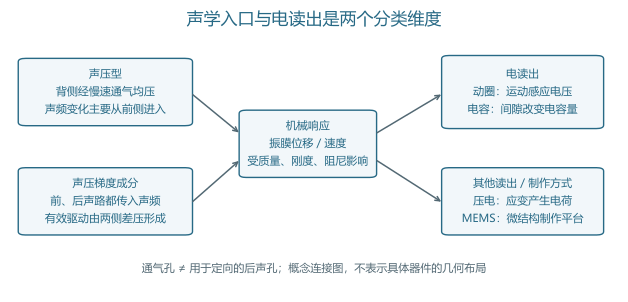
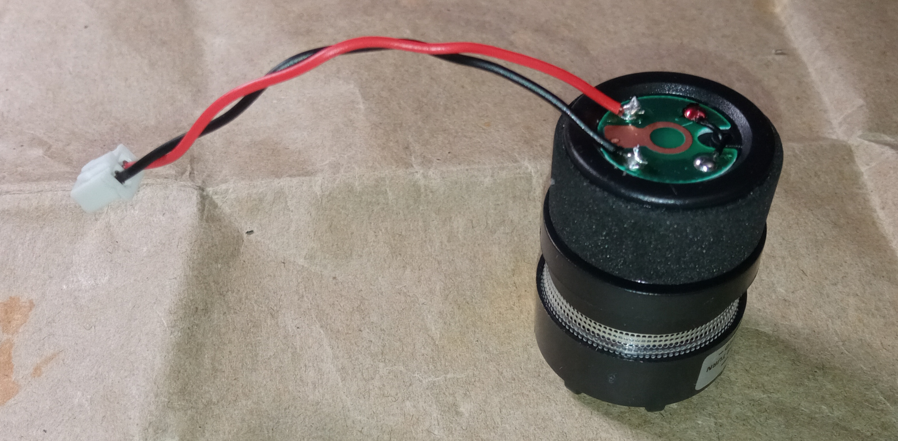
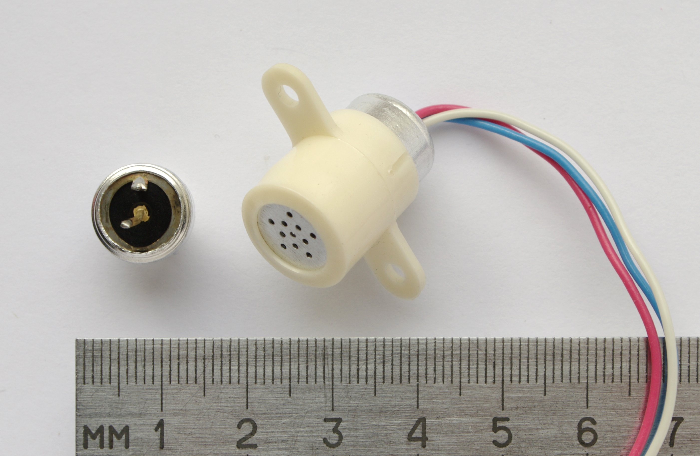
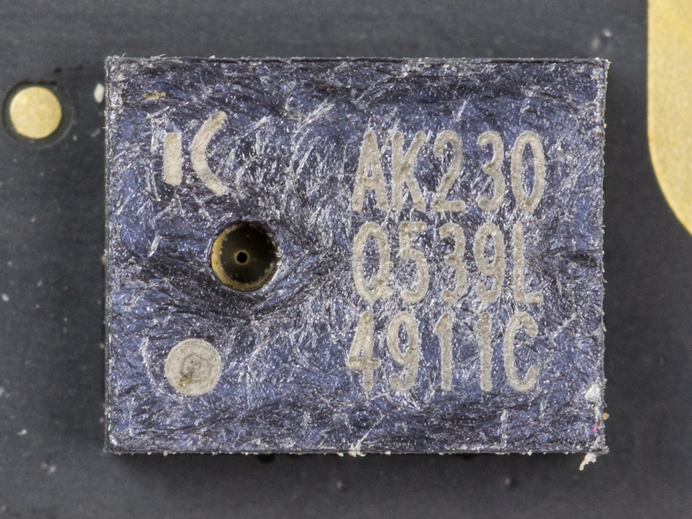
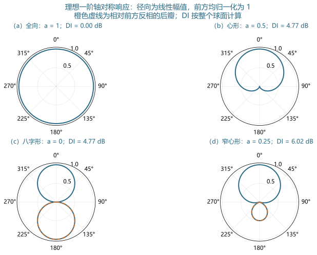
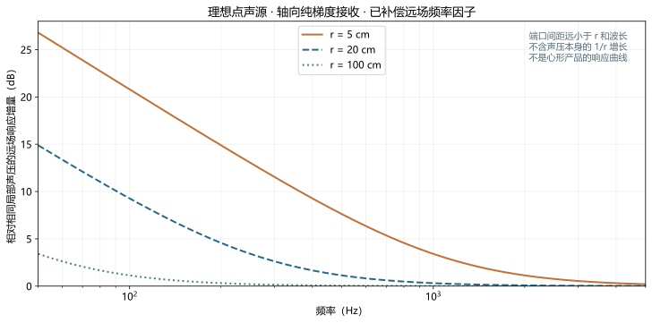
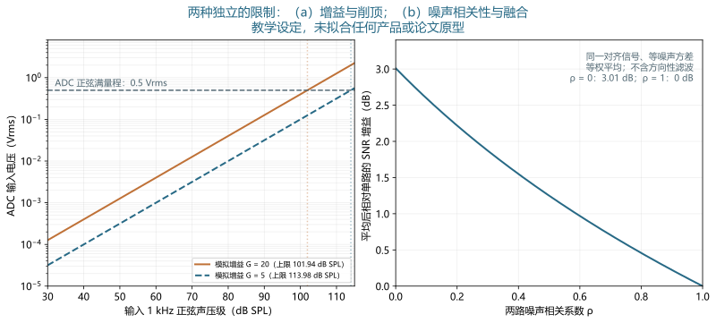

# 传声器

> 拾音机制、声路、方向响应、噪声与校准 · 深度词条 · 2026-10-10 · Draft，尚未完成专业审阅

**传声器**（microphone）是把声学输入转换为电信号的器件，也称麦克风或话筒。常见传声器先由声场驱动振膜，再通过电磁、电容或压电等机制读出运动。这个定义强调信号转换；带有偏置、前置放大器或数字接口的传声器还使用外部电源，不能把输出电信号的全部能量都归于入射声波。[1](#ref-et-ni-handbook)[3](#ref-mic-dpa-essentials)

传声器是[电声换能器](https://betterci.github.io/n3-hearingpedia/concepts/electroacoustic-transducer/)的输入端器件。它既可以记录言语、环境声和动物发声，也可以充当声学测量的参考。在听觉辅助设备中，传声器提供后续处理所用的声学信号；在实验中，它决定研究者能够观察到哪些声学变化。录音听起来清楚、器件输出较大与测量可追溯，是三个需要分别验证的目标。[2](#ref-et-iec60268-4)[4](#ref-mic-bk-handbook)

## 分类：一个名称可以包含多个维度

### 换能机制与指向性分别描述

动圈、电容和压电回答“机械变化怎样转成电信号”；全向、心形和八字形回答“不同方向的声音怎样改变输出”。二者没有一一对应关系。动圈传声器可以采用不同声路，电容传声器也可以具有全向或定向响应。型号说明中的“电容心形”同时给出两个维度，不能把“电容”当作“能拒绝后方声音”的充分条件。[1](#ref-et-ni-handbook)[3](#ref-mic-dpa-essentials)

驻极体是电容结构的一种极化实现；微机电系统（microelectromechanical systems，MEMS）主要描述微结构制作与集成方式。MEMS 器件可以采用电容或压电读出，输出也可以是模拟电压或数字码流。因此，“MEMS”“数字”“全向”可以同时描述同一个器件，各自指向不同性质。[6](#ref-mic-tu-electret)[7](#ref-mic-hybrid-2026)[8](#ref-et-adi-sensitivity)

### 录音器件与测量器件的用途

录音传声器可能有意修饰频率响应，以适应特定声音制作。测量传声器则需要响应与不确定度能够被描述，尤其要明确声场和安装条件。测量用途并不要求所有频率下的原始输出都完全相同，而要求转换关系可校准、可修正。IEC 60268-4:2018 的公开范围针对声系统传声器，并明确排除测量传声器；测量传声器另由 IEC 61094 系列规定相关要求和方法。[2](#ref-et-iec60268-4)[13](#ref-et-iec61094-2)[14](#ref-mic-iec61094-3)

“无线话筒”还包含无线发送和接收链，名称并不说明敏感单元的换能机制。评价整个产品时，需要知道信号是否经过增益控制、压缩、滤波或编码。完整设备的数字文件，未必等同于胶囊的原始输出；一个频率响应或噪声数值，应注明所覆盖的链路起点和终点。

## 从振膜运动到电信号

### 动圈与带式读出

动圈结构把线圈与振膜相连，线圈在磁场中运动时产生感应电压。简化关系为 $e=Blv$，其中 $e$ 为电压（V），$B$ 为磁通密度（T），$l$ 为有效导线长度（m），$v$ 为运动速度（m/s）。由声压到速度的机械响应仍受质量、弹性和阻尼控制，因此这个式子不是完整的声压—电压灵敏度。输出端的负载也会影响实际读到的电压。[1](#ref-et-ni-handbook)

带式结构让薄导电带本身在磁场中运动，避免把所有电磁读出都理解成“振膜上粘着一只线圈”。敏感单元无需外部极化电压，并不意味着所有成品都无需供电；有源产品还可能包含缓冲放大器。讨论是否供电时，必须说明对象是换能单元还是完整话筒。[3](#ref-mic-dpa-essentials)

### 电容、外极化与驻极体

电容结构由可运动电极和固定电极形成电容。忽略边缘场、假设平行板和小位移时，$C(x)=\varepsilon A/(g-x)$，因而 $\Delta C/C_0\approx x/g$。这里 $A$ 为有效面积（m²），$g$ 为静态间隙（m），$x$ 为朝固定电极方向的位移（m），$\varepsilon$ 为介电常数（F/m）。间隙改变是机械运动的结果；读出电路再把电容量的变化转成电信号。[4](#ref-mic-bk-handbook)

在极化电阻足够大、声频变化期间电荷近似不变的经典读出模型中，$V=Q/C$，所以 $\Delta V/V_0\approx-\Delta C/C_0$。负号只表示所选位移和电压方向下的相位关系。恒压偏置配合电荷放大或其他读出时，电路关系需要另写，不能把恒电荷模型当成全部 MEMS 接口电路的公式。偏置场、振膜静态挠曲与大信号非线性也没有包括在这个小位移近似内。[4](#ref-mic-bk-handbook)

驻极体材料保存电荷，用于提供极化场。Sessler 与 West 在 1962 年报道了使用金属化驻极体薄膜、无需外加直流极化的电容传声器；这项经典工作解释了极化来源的改变。它不支持“现代驻极体话筒都不耗电”的说法，因为许多成品还需要给阻抗转换器或放大电路供电。膜驻极体与背极驻极体的带电材料位置也不同。[5](#ref-mic-sessler-1962)[6](#ref-mic-tu-electret)[1](#ref-et-ni-handbook)

### 压电与 MEMS

压电读出利用受力或弯曲产生的电荷，输出取决于材料、应变分布、电极位置和接口电路。电容 MEMS 则把振膜、背板、间隙及通气结构做成微结构。尺寸缩小后，空气阻尼、寄生电容和封装声孔都可能进入性能解释；“微型”不能单独推出低噪声或宽频带。[7](#ref-mic-hybrid-2026)[9](#ref-et-adi-preamp)

<figure>
  
  <figcaption>图1．声学入口与电读出。左侧区分声频是否经后声路进入，右侧区分运动的电检测方式；连接不表示某种机制只允许一种指向性。慢速均压孔不能直接当作定向后声孔。原创概念图，不表示实际尺寸或内部器件布局；依据文献[1]、[3]、[4]、[7]的机制说明归纳。</figcaption>
</figure>

## 实物：外壳、胶囊和封装分别能看到什么

实物照片有助于辨认装配层次，但不能从照片推断频率响应。网罩、声孔和电路板可见，并不意味着振膜材料、内部声阻或校准系数已知。下列照片分别展示动圈胶囊、驻极体组件和 MEMS 封装；它们没有共同的测试条件，不构成三种技术的性能排名。

<figure>
  

    

（a）SM58 动圈胶囊实物。官方手册确认该型号为动圈心形；照片本身不用于测定指向性。<a href="#ref-mic-shure-sm58">[21]</a> 摄影：Monoklon，<a href="https://commons.wikimedia.org/wiki/File:Капсюль_Shure_SM58.jpg">原图来源</a>，<a href="https://creativecommons.org/licenses/by/4.0/">CC BY 4.0</a>。

    

（b）MKE-3 驻极体敏感胶囊与含缓冲放大器的组件。摄影：Kae，<a href="https://commons.wikimedia.org/wiki/File:Electret_microphone_MKE3.JPG">原图来源</a>，<a href="https://creativecommons.org/licenses/by-sa/3.0/">CC BY-SA 3.0</a>。

    

（c）AKU230 CMOS MEMS 数字传声器封装；可见的是封装与声孔。© Raimond Spekking / <a href="https://commons.wikimedia.org/wiki/File:Asus_Zenbook_UX32V_-_webcam_module_-_AK230_0539L_4911C-0108.jpg">Wikimedia Commons</a>，<a href="https://creativecommons.org/licenses/by-sa/4.0/">CC BY-SA 4.0</a>。

  

  <figcaption>图2．三类传声器的实物层次。照片保留原文件，本站仅通过网页样式等比例显示，未裁切或重绘；驻极体与 MEMS 照片复用“电声换能器”词条已核对的来源。器件名称和许可分别见各图说明，不能从外观比较灵敏度、自噪声或音质。点击可查看原尺寸文件。</figcaption>
</figure>

## 声路怎样形成方向响应

### 声压型：通气均压不等于后声路

理想声压型传声器在声频范围主要由前方声压驱动，背腔提供机械与声学负载。它仍可能设置通气路径，让缓慢变化的静态气压得到均衡；该路径对低频截止也有影响。因此，看到通气孔，不能立即判断器件是声压梯度型。关键是该路径在研究频带内怎样传递声频压力。[4](#ref-mic-bk-handbook)

当器件尺寸远小于波长时，理想声压型可近似全向。频率升高、波长与器件尺寸接近后，机身绕射、网罩及声孔会改变各入射角的响应。全向是某个条件下的近似性质，不是“任何频率、任何安装位置都一样”。佩戴在头上或装入设备后，还会叠加身体和外壳的声场影响。[3](#ref-mic-dpa-essentials)[4](#ref-mic-bk-handbook)

### 梯度成分：两侧差压与频率补偿

若声音经前后两条声路作用于振膜，驱动取决于两侧压力差。对远场平面波、很小的端口间距 $d$，差压近似正比于 $kd\cos\theta$，其中 $k=2\pi f/c$ 为波数（rad/m），$f$ 为频率（Hz），$c$ 为声速（m/s），$\theta$ 为入射方向与前轴的夹角。裸差压带有随频率增加的因子；完成机械、声学或电补偿后，才能讨论近似平坦的梯度型输出。[3](#ref-mic-dpa-essentials)

理想纯梯度成分形成八字形响应；声压成分与梯度成分按比例组合，则可形成心形等一阶模式。实际定向器件中的延迟、声阻、腔体和电子处理需要共同考虑。“后方抵消”表示声路和相位关系产生的选择性，并不等同于电路已经识别了噪声。若后方是需要记录的说话者，同样可能被衰减。

## 指向图怎样读：幅值、相位与整个球面

### 一阶模型的可复算比较

为比较基本模式，采用远场、轴对称、前轴归一化的一阶教学模型：

$$
D(\theta)=a+(1-a)\cos\theta,\qquad 0\leq a\leq1.
$$

$D$ 是有符号的相对响应，$a$ 为声压成分的无量纲权重。$a=1$ 为全向，$a=1/2$ 为心形，$a=0$ 为八字形。负值意味着相对前轴反相；如果极坐标图只画 $|D|$，八字形后瓣看起来与前瓣一样大，但相位关系已被隐藏。图3用虚线标记这一差别。真实器件应在多个频率分别测量，不能用一张理想曲线代替宽带指向性。[3](#ref-mic-dpa-essentials)[10](#ref-mic-dpa-specs)

漫射场中各方向等强且互不相关时，前轴灵敏度归一化后的方向因子 $Q$ 与指向性指数（directivity index，DI）可由球面平均功率推得：

$$
Q=\frac{1}{\frac{1}{4\pi}\int_{\Omega}|D(\theta)|^2\,\mathrm{d}\Omega}
=\frac{1}{a^2+(1-a)^2/3},\qquad
\mathrm{DI}=10\log_{10}Q.
$$

积分范围是整个球面，$\mathrm{d}\Omega$ 是立体角元。因 $\cos\theta$ 的球面平均为零、$\cos^2\theta$ 的平均为 $1/3$，可得到右侧解析式。心形与八字形均有 $Q=3$、DI 约 4.77 dB，尽管二者在后方的响应完全不同。这个例子说明单个 DI 数值不能定位哪个方向被保留或被抑制。

<figure>
  
  <figcaption>图3．理想一阶指向模式。（a）全向，（b）心形，（c）八字形，（d）窄心形模型（hypercardioid，a=0.25）。径向为线性幅值，前轴均归一化为1；橙色虚线标记反相后瓣。DI 按整个球面计算，a=0.25 时 Q=4、DI 约6.02 dB，是本模型的最大值。原创解析计算，不是实测产品曲线；未包含高频绕射、近场或安装影响。模式背景见文献[3]、[10]，球面积分由本文给定模型推导。</figcaption>
</figure>

### 指向性收益的条件

在该理想模型中，DI 对应前轴目标相对于漫射声场的物理信噪比优势。它不等于任意噪声布置下的改善量，也不等于言语识别分数。目标与干扰从同一方向到达时，一阶方向筛选对二者施加相同权重；单个后方干扰则需要看该角度的响应。多个反射路径还会改变目标和干扰的空间结构。[20](#ref-mic-chung-2004)

对于阵列，方向选择也可通过多只传声器的信号组合形成。端口间距、延迟、幅度和相位匹配共同影响抵消。两只全向单元装在一起，并不自动产生某张预定指向图；必须明确使用的处理与装配条件。头部佩戴系统的整机方向响应还应与裸单元的自由场方向响应分开报告。

## 近讲效应：距离改变的不只是响度

### 幅度梯度叠加到相位梯度

含梯度成分的传声器靠近声源时，前后声路除了传播相位差，还可能接收到不同幅度。理想点声源的声压随 $1/r$ 变化，越近时，两侧距离差所带来的相对幅度差越大。这会使低频响应相对于远场条件升高，形成近讲效应（proximity effect）。源形状、入射角和器件补偿都会影响它，不能给所有心形话筒指定一个固定的“低频增加量”。[11](#ref-mic-dpa-proximity)

为了区分近讲效应与“整体更响”，令理想球面波复声压为 $p(r)\propto e^{-ikr}/r$。沿半径求导得到 $\partial p/\partial r=p(-ik-1/r)$：$-ikp$ 是远场相位梯度项，$-p/r$ 是额外幅度梯度项。对轴向纯梯度接收、已补偿远场频率因子且端口间距远小于 $r$ 与波长的情况，在相同局部声压下，其幅度相对于远场模型的比值为：

$$
\frac{|D_{\mathrm{near}}|}{|D_{\mathrm{far}}|}
=\sqrt{1+\frac{1}{(kr)^2}}.
$$

这里比较的是方向性转换关系，已除去点声源声压本身的 $1/r$ 增长。因而把话筒靠近声源时，整体级别提高与低频比例增加应分别分析。这个推导只对应理想纯梯度模型；把它直接当作某只心形产品的均衡曲线，会忽略声压成分、声路网络和近距离几何条件。

<figure>
  
  <figcaption>图4．纯梯度教学模型的距离效应。取声速343 m/s、点声源、轴向入射、端口间距可忽略，距离分别为5、20、100 cm；纵轴是相同局部声压条件下，相对已补偿远场响应的增量。频率范围50–5000 Hz；不含整体1/r声压增加。原创解析计算，用于解释幅度梯度项，不代表录音话筒或助听器的实际补偿；声源与声路条件的背景见文献[11]。</figcaption>
</figure>

### 录音与研究中的处理

把传声器移近嘴部，可能同时提高直达声比例、改变低频形状，并增加喷气影响。即使把不同录音的整体有效值归一化，频谱差异仍可能保留；对音色、言语包络或说话人特征的比较，这种变化可能构成混杂因素。需要固定距离和角度，或把距离明确设为实验变量。

理想声压型没有上述纯梯度近讲机制，但靠近声源仍会改变实际接收声场，不能理解成“全向话筒移动位置后频谱永远不变”。扩展声源也未必在全部距离和频率上等效为点声源。实际人声录音还受声源辐射、头部遮挡、反射以及网罩影响，必要时应测量完整条件。[11](#ref-mic-dpa-proximity)[21](#ref-mic-shure-sm58)

## 灵敏度与频率响应：每个参考量都要有位置

### 声压到模拟电压

模拟灵敏度可写成 $M(f)=V_{\mathrm{out}}(f)/p(f)$，单位 V/Pa，通常在指定频率、方向、负载和声场下报告。用对数表示时，需要写明参考为 1 V/Pa；10 mV/Pa 对应 −40 dB re 1 V/Pa。声压的空气声参考为20 μPa，1 Pa 有效值对应约93.98 dB SPL，常按94 dB 表示。[8](#ref-et-adi-sensitivity)[12](#ref-et-ni-measurement)

开路灵敏度与接入有限输入阻抗后的输出可能不同。只有传声器输出阻抗相对负载足够小时，负载导致的衰减才可忽略。平衡模拟接口还涉及差分电压的定义；应说明测量的是两根信号线之间还是相对地。随后的模拟增益可以放大电压，不能反过来冒充敏感单元的本征灵敏度。

### 数字输出及处理状态

数字灵敏度以码值相对满量程表示，常写为指定声压下的 dBFS；它与模拟 dBV 使用不同参考。满量程正弦的有效值与峰值还相差 $\sqrt{2}$，所以比较数据时必须统一约定。对于脉冲密度调制（pulse-density modulation，PDM）等接口，解码、抽取滤波、缩放及采样率共同决定后续 PCM 文件的带宽和标度。[8](#ref-et-adi-sensitivity)

自动增益控制、限幅或降噪开启后，输出不再是一个固定线性增益乘输入。设备的“录音音量”滑块也未必对应已知 dB 数值。需要记录处理状态、音频格式和增益；若目标是测量声压，最好通过已知输入核对完整转换，而非凭文件峰值推断环境声级。

频率响应曲线还需要标注距离、方向、声场和是否归一化。若两条曲线各自减去1 kHz值，它们可以比较相对形状，却不能据此比较绝对灵敏度。显示范围很窄或纵轴单位不同，也会影响读者对平坦程度的判断。[10](#ref-mic-dpa-specs)

## 噪声与动态范围：最早限制整条链的环节

### 自噪声不是环境噪声

自噪声可来自敏感结构的热运动、电路以及接口读出。等效输入噪声把输出噪声经灵敏度折算为声压，有助于与目标信号比较。背景声、风噪、接触振动与电源干扰则需要另行控制；一段“安静房间的录音”同时包含这些贡献，不足以直接得到器件自噪声。[4](#ref-mic-bk-handbook)[9](#ref-et-adi-preamp)

比较噪声指标时，要统一频率范围、计权和积分方式。幅度谱密度（V/√Hz）与功率谱密度（V²/Hz）不是同一量；它们也都不是已积分的有效值噪声电压。若 $S_v(f)$ 是输出噪声功率谱密度，$W(f)$ 是所用滤波或计权的幅度响应，则 $v_n^2=\int |W(f)|^2S_v(f)\,\mathrm{d}f$。灵敏度随频率变化时，折算到声压端还需用对应的 $|M(f)|^2$ 除谱密度，而不能只用一个1 kHz数值处理任意宽带噪声。[9](#ref-et-adi-preamp)

以94 dB SPL参考输入与A计权等效噪声级作差，可以形成一种常见器件 SNR 约定；这个值描述规定测试条件，不是任意现场录音的信噪比。未计权噪声、A计权噪声和单一频率附近的噪声密度应分别报告。噪声来源、谱形与带宽对弱声实验尤其重要。[10](#ref-mic-dpa-specs)

### 最大输入与可复算增益例子

声学过载点（acoustic overload point，AOP）或最大输入声压级，需要与规定失真阈值和频率相连。器件尚未达到声学过载点，前置放大器或模数转换器（analog-to-digital converter，ADC）也可能先削顶。[动态范围](https://betterci.github.io/n3-hearingpedia/concepts/dynamic-range/)应按同一链路、同一带宽及可接受非线性定义，不宜把产品表中两个不同条件的端点直接相减。[9](#ref-et-adi-preamp)[10](#ref-mic-dpa-specs)

图5a采用教学设定：1 kHz灵敏度10 mV/Pa，模拟增益 $G=20$，ADC正弦满量程0.5 Vrms，即峰值约0.707 V。暂假设传声器与放大器在到达该上限前均保持线性，最大可接收的正弦声压由 $p_{\max}=0.5/(20\times0.01)=2.5$ Pa决定，约101.94 dB SPL。对1 Pa输入，ADC收到0.2 Vrms，距离正弦满量程还有约7.96 dB余量。

若只把增益降到5，同一ADC允许的正弦输入变为10 Pa，约113.98 dB SPL，上限提高约12.04 dB。代价是弱声在ADC端的电压也减小；若ADC噪声不可忽略，折算输入后的噪声可能增大。该例没有给定具体传声器的真实AOP，因此结果是ADC限制的上限，不能声称整机一定能线性测到该声级。言语瞬时峰值还需要按实际峰值而非正弦有效值检查余量。

<figure>
  
  <figcaption>图5．增益与噪声融合的两个教学比较。（a）10 mV/Pa、1 kHz正弦、ADC满量程0.5 Vrms；曲线超过横线的部分只是线性外推，实际ADC会削顶。（b）两路已对齐且同增益的相同信号，噪声方差相等，采用等权平均；ρ=0时SNR增益约3.01 dB，ρ=1时为0 dB。两面板是独立解析例子，不是同一器件的实测。右图假设和推导见后文；原理背景见文献[7]、[9]。</figcaption>
</figure>

## 声场与校准：把输出连接到可追溯输入

### 压力场、自由场与漫射场

压力灵敏度针对振膜处规定压力；自由场灵敏度以传声器放入前的声场为参考，并考虑器件对声场的扰动；漫射场响应涉及来自多方向的能量平均。机身绕射和振膜处压力增加会使这些响应在高频出现差别，不能把压力场校准系数直接当成任意方向的自由场系数。[4](#ref-mic-bk-handbook)[12](#ref-et-ni-measurement)

网罩、保护栅和外壳同样属于条件。移除网罩后再使用原校准，或在头部附近测量却按无限自由场解释，都可能引入系统误差。校准证书上的灵敏度、频率响应、环境条件和不确定度，应与实际安装对应。这里的“校准”不同于用后期均衡让一段录音听起来相似。[4](#ref-mic-bk-handbook)

| 公开标准范围 | 所回答的问题 | 应保留的边界 |
| --- | --- | --- |
| IEC 61094-2:2009及2022修订 | 用互易技术确定实验室标准传声器的复压力灵敏度 | 特定适用传声器与实验室方法，不是普通录音设备的现场操作说明 |
| IEC 61094-3:2016 | 实验室标准传声器的自由场互易校准 | 需要适用器件及相应声场、设备与专业条件 |
| IEC 61094-5:2016 | 比较法确定工作标准传声器的压力灵敏度 | 依赖参考器件及比较声场，不自动给出任意入射角响应 |
| IEC 61094-8:2012 | 比较法确定工作标准传声器的自由场灵敏度 | 参考值、空间布置及自由场近似需要控制 |
| IEC 60942:2017 | 声校准器的性能要求和等级 | 校准器与规定传声器、适配器、配置配合使用 |

上述版本和范围依据IEC官方公开目录核对，本站没有获得这些标准的全部付费条款，不据表格宣称器件符合性，也不转录完整实施步骤。[13](#ref-et-iec61094-2)[14](#ref-mic-iec61094-3)[15](#ref-mic-iec61094-5)[16](#ref-mic-iec61094-8)[17](#ref-mic-iec60942)

### 现场检查能确认什么

声校准器在指定耦合条件下产生已知声压，常用于检查或调整整条声学测量链的灵敏度。正确使用适配器、密封和规定配置，是检查有效的前提；校准器本身也要有可靠的校准。IEC TC29的说明将这种用途与特定器件的压力灵敏度确定联系起来。[18](#ref-mic-iec-calibrators)

单频检查前后相符，支持该频率和配置下的链路稳定，却不能证明全频带响应、指向性、自噪声或所有声级下的线性均合格。实验应按问题增加相应测试：比较频谱就核对频响，比较角度就核对方向响应，研究很弱的信号就测背景与等效输入噪声。完整关系可接续阅读[测听校准](https://betterci.github.io/n3-hearingpedia/concepts/audiometric-calibration/)，但测量传声器校准与听力级基准仍是不同环节。

## 听觉研究怎样控制传声器带来的混杂

### 言语录音的研究设计例子

假设研究者要比较两组说话人的低频能量和[时域包络](https://betterci.github.io/n3-hearingpedia/concepts/temporal-envelope/)。一个可检验的设计是让同一说话人在预设距离和角度下重复相同材料，固定同一传声器、增益、采样率和处理状态，再检验位置变化造成的频谱差异是否小于待比较效应。这是本文提出的控制设计，并非已经完成的人体实验；采样量和统计模型应按研究问题另定。

若采用定向话筒，需固定嘴到有效声学入口的距离，避免把说话人之间的姿势差异当成声源差异。实验顺序可以平衡，保存未经均衡的原始文件，并记录峰值及背景。先分别测量安静背景和参考输入，有助于区分背景声级变化、链路漂移和声源变化。后期整体响度归一化不能替代前端距离控制，因近讲效应改变的是相对谱形。

对目标语音的声压计量，还应确认测量位置。嘴前的声压、头戴话筒入口的声压与听者位置的声压属于不同量。将录音再播放给受试者时，播放换能器与入耳声压需要另一轮校准；原始传声器灵敏度不能决定受试者实际接收到的刺激。此处连接[言语可懂度](https://betterci.github.io/n3-hearingpedia/concepts/speech-intelligibility/)、[房间声学](https://betterci.github.io/n3-hearingpedia/concepts/room-acoustics/)和[声波与传播](https://betterci.github.io/n3-hearingpedia/concepts/sound-waves-and-propagation/)。

### 弱声探测、空间记录与辅助设备

[耳声发射](https://betterci.github.io/n3-hearingpedia/concepts/otoacoustic-emissions/)探头同时包含声输出与接收。测到的声压还可能包含刺激泄漏、环境噪声和耳道连接影响，不能把微弱记录全部解释为生理反应。此时需要按探头、声管和规定负载测量整条系统，而不仅是给裸传声器贴上“低噪声”标签。声学探头的作用是提供物理记录，生理归因还依赖相应范式和控制。

空间记录或传声器阵列需要保存通道间的增益和相位关系。幅度匹配不代表相位也匹配；不同滤波或延迟会改变定位和抵消。研究[双耳听觉](https://betterci.github.io/n3-hearingpedia/concepts/binaural-hearing/)时，头部、耳廓与入口位置本身就是声音变换的一部分，不能把安装后的响应都归于传声器单元。[4](#ref-mic-bk-handbook)[20](#ref-mic-chung-2004)

[助听器](https://betterci.github.io/n3-hearingpedia/concepts/hearing-aid/)和[人工耳蜗](https://betterci.github.io/n3-hearingpedia/concepts/cochlear-implant/)前端可利用方向性处理改善某些空间布置下的输入。是否改善使用者的言语识别，还要用明确人群、任务、目标位置和噪声条件的行为测量验证。早期综述已强调实验室与日常场景可能不同；裸器件DI不能直接替代整机或人的表现。[19](#ref-nidcd-hearing-aids)[20](#ref-mic-chung-2004)

## MEMS 前沿：提高灵敏度与降低噪声不是同一件事

### 一个能够核对条件的混合读出原型

Guan等于2026年报告AlN压电与电容混合MEMS传声器。在14×14 mm平面波管、同轴向位置参考传声器和19.2 V偏置下测试；1 kHz灵敏度在压电、电容和直接混合模式分别约0.61、1.79、2.39 mV/Pa。直接混合输出虽更大，论文报告的1 kHz噪声密度换算SNR为62.2 dB，低于压电模式的65.7 dB；加权融合后为66.7 dB。[7](#ref-mic-hybrid-2026)

这里的数值依论文的单频噪声密度及换算方法报告，没有被重新解释为20 Hz–20 kHz积分的A计权产品SNR。作者归因于电容通道与读出电路噪声的耦合，并用同步双输出及后处理权重优化融合。它是器件原型与信号读出研究，尚不能证明商用成品的电耗、量产一致性或使用者听觉获益。[7](#ref-mic-hybrid-2026)

### 为什么两路相加不必然改善信噪比

独立教学模型可说明融合条件。设两路经增益和相位匹配后都含同一信号 $s$，加性噪声分别为 $n_1,n_2$，且方差均为 $\sigma^2$。等权平均 $y=s+(n_1+n_2)/2$ 的噪声方差由协方差展开得到：

$$
\sigma_y^2=\frac{\sigma^2}{2}(1+\rho),\qquad
\Delta\mathrm{SNR}=10\log_{10}\!\left(\frac{2}{1+\rho}\right).
$$

$\rho$ 是两路噪声的相关系数，图5b只画 $0\leq\rho\leq1$。不相关时约改善3.01 dB，完全同相相关时没有改善；机械共模噪声、同一背景声或共同干扰不一定能按独立噪声平均掉。噪声方差不等时，最佳权重也不再是各一半。这是协方差代数的教学推导，与论文的具体权重和不等通道灵敏度不同。[7](#ref-mic-hybrid-2026)

未来比较应同时记录敏感结构、封装和电路状态，统一带宽、计权、失真阈值及功耗条件。验证算法还需要在不同样本和环境下检查权重是否稳定，避免只对同一测试数据调参后报告收益。小信号模型能够解释主要线性关系，却需要大信号和环境测试补充；单个原型的优势不能自动扩展成一种材料或技术路线的普遍优势。

## 读结果时应保留的边界

传声器记录的是指定位置、方向和链路下的声学输入。它既不直接测出听者的响度，也不自动分离声源、生理反应和干扰。一个可靠结果应使读者能够回答：采样位置在哪里、用了什么机制与声路、参考量是什么、哪些处理已开启，以及噪声和线性上限如何验证。

“高灵敏度”“全向”“数字输出”各自都只回答一个局部问题。高灵敏度可能减小后续读出噪声的相对影响，也可能减少给定增益下的输入余量；全向在低频近似成立，安装后还要重新解释；数字输出免去外部模拟接线的一些环节，却仍依赖内部模拟转换、时钟与滤波。评价应连接到实际任务，而非依名称排序。

继续阅读可从[电声换能器](https://betterci.github.io/n3-hearingpedia/concepts/electroacoustic-transducer/)进入物理端口，从[频谱与功率谱密度](https://betterci.github.io/n3-hearingpedia/concepts/spectrum-and-power-spectral-density/)理解噪声积分，再通过[动态范围](https://betterci.github.io/n3-hearingpedia/concepts/dynamic-range/)和[测听校准](https://betterci.github.io/n3-hearingpedia/concepts/audiometric-calibration/)把录音与受控刺激连接起来。声场校准、解析模型与器件原型分别提供不同层面的依据，所用证据应与结论的尺度对应。

## 参考文献与证据范围

[1] NI / PCB Piezotronics (2025). <a href="https://www.ni.com/en/shop/data-acquisition/sensor-fundamentals/measuring-sound-with-microphones/microphone-handbook.html">Microphone Handbook: Types, Components &amp; Testing</a>. NI 官方传感器技术资料（PCB 材料获许可转载）。访问范围：documentation。阅读电容、驻极体、动圈结构及极化／前置放大器说明；解释基本转换和供电关系。转载内容不计为第二个独立研究。

[2] International Electrotechnical Commission (2018). <a href="https://webstore.iec.ch/en/publication/63860">IEC 60268-4:2018: Microphones (RLV 目录)</a>. IEC 官方标准目录。访问范围：documentation。读取公开范围：声系统麦克风的灵敏度、指向性、阻抗、动态范围和外界影响，范围不含测量麦克风；目录 RLV 含官方版本及红线版本，未获取完整标准。

[3] DPA Microphones (n.d.). <a href="https://www.dpamicrophones.com/mic-university/technology/microphone-technology-the-essentials/">Microphone technology – the essentials</a>. 制造商官方工程说明。访问范围：documentation。读取压力／梯度及组合、动圈／带式／电容分类和声场影响段；支持声路与读出分类。本站方向模型和球面积分为独立教学推导，不转载原图或采用营销比较。

[4] Brüel &amp; Kjær (2019). <a href="https://www.bksv.com/doc/be1447.pdf">Microphone Handbook, Volume 1 (BE 1447–12, March 2019)</a>. Brüel &amp; Kjær 官方技术手册，所核版本155页。访问范围：documentation。取得PDF并核对版本页，选读PDF第25–26页声场、第32–34页恒电荷与驻极体、第89–93页场响应和噪声、第147–148页校准与检查段；未逐页通读，未转载整本手册、原图或旧标准实施条款。补充核对第37–38页均压和低频响应。

[5] G. M. Sessler; J. E. West (1962). <a href="https://doi.org/10.1121/1.1909130">Self-Biased Condenser Microphone with High Capacitance</a>. The Journal of the Acoustical Society of America, 34(11), 1787–1788。访问范围：abstract。核对OpenAlex摘要与Crossref元数据，并以作者所在机构技术词汇页交叉核对书目和驻极体机制；只引用无需外加直流极化的原理，不转录未核对全文的性能。注意此处为11期单数Microphone，区别于DOI 10.1121/1.1937012的12期补刊复数标题。

[6] Institut für Nachrichtentechnik, Technische Universität Darmstadt (n.d.). <a href="https://www.nt.tu-darmstadt.de/ehemalige_fachgebiete_nt/elektroakustik_nt/forschung_ea/glossar_ea_nt/ecm_ea_nt/index.en.jsp">Electret Condenser Microphone (ECM)</a>. 作者研究机构官方技术词汇页。访问范围：documentation。读取驻极体薄膜、膜／背极两种安排、声压引起交流输出和1962论文书目；不使用网页旧市场份额估计或据此声称当今市场状态。

[7] Yangyang Guan; Michael Schneider; Dongsheng Li; Hemin Zhang; Jing Mi; Alexander Bertrand; Sina Sadeghpour; Chen Wang; Huicong Liu; Christ Glorieux; Michael Kraft (2026). <a href="https://www.nature.com/articles/s41378-026-01251-y">A capacitive-piezoelectric hybrid MEMS microphone with signal fusion for enhancing signal-to-noise ratio</a>. Microsystems &amp; Nanoengineering, 12, 136。访问范围：fulltext。通过Europe PMC XML选读结构、Measurement Setup、Frequency Response、Noise Floor、Signal Fusion与Conclusion；核对14×14 mm管、19.2 V偏置、1 kHz灵敏度与SNR。论文按1 kHz噪声密度换算的数值不当作宽带A计权噪声指标；直接混合低于压电模式是反例。本站等噪声平均例子不是论文权重复刻。

[8] Jerad Lewis (2012). <a href="https://www.analog.com/en/resources/analog-dialogue/articles/understanding-microphone-sensitivity.html">Understanding Microphone Sensitivity</a>. Analog Dialogue, 46 (May), Analog Devices。访问范围：documentation。阅读 Analog vs. Digital 和 Choosing Sensitivity：模拟／数字参考、峰值／有效值约定及灵敏度不等于质量。换算图使用独立假设的20 mV/Pa，不引用产品性能。

[9] Jerad Lewis (2013). <a href="https://www.analog.com/media/en/technical-documentation/application-notes/AN-1165.pdf">AN-1165: Op Amps for MEMS Microphone Preamp Circuits (Rev. A)</a>. Analog Devices Application Note。访问范围：documentation。阅读第1–3页 Introduction、Noise、THD+N、Supply Voltage 及电路说明；支持读出增益、噪声带宽和供电限制。不照搬示例器件推荐。

[10] Eddy Bøgh Brixen (n.d.). <a href="https://www.dpamicrophones.com/mic-university/technology/how-to-read-microphone-specifications/">How to read microphone specifications</a>. DPA Microphones 官方技术说明。访问范围：documentation。读取Directional pattern、Sensitivity、Equivalent noise、Maximum SPL、Dynamic range与SNR相关段；采用参考条件和指标区别，不采用网页中泛化的主观响度或消费者评价。

[11] Eddy Bøgh Brixen (n.d.). <a href="https://www.dpamicrophones.com/mic-university/background-knowledge/proximity-effect-in-microphones-explained/">Proximity effect in microphones explained – how it affects different sound sources</a>. DPA Microphones 官方技术说明。访问范围：documentation。读取点／线／面源、额外幅度梯度和角度条件；不把具体乐器示例扩展为普遍声源分类。本站纯梯度点声源公式和曲线为显式假设下的独立推导，未复制产品测试曲线。

[12] NI (n.d.). <a href="https://www.ni.com/en/shop/data-acquisition/sensor-fundamentals/measuring-sound-with-microphones.html">Measuring Sound with Microphones</a>. NI 官方传感器技术资料。访问范围：documentation。阅读麦克风物理类型、选择、场响应及信号调理说明；支持压电和电容检测、场条件和测量链。未将声压与声压级混作同一单位。

[13] International Electrotechnical Commission (2009/2022). <a href="https://webstore.iec.ch/en/publication/4486">IEC 61094-2:2009: Pressure calibration by the reciprocity technique; AMD1:2022</a>. IEC 官方标准目录。访问范围：documentation。读取基础版公开范围，并核对2022修订目录 https://webstore.iec.ch/en/publication/67521；限定实验室标准等适用麦克风及复杂压力灵敏度。未转录互易校准步骤。

[14] International Electrotechnical Commission (2016). <a href="https://webstore.iec.ch/en/publication/25105">IEC 61094-3:2016: Primary method for free-field calibration of laboratory standard microphones by the reciprocity technique</a>. IEC 官方标准目录。访问范围：documentation。核对公开范围与2016版本：复自由场灵敏度、实验室标准等适用器件、专业设备和人员条件。未获取完整标准，不转录互易实验步骤。

[15] International Electrotechnical Commission (2016). <a href="https://webstore.iec.ch/en/publication/24988">IEC 61094-5:2016: Methods for pressure calibration of working standard microphones by comparison</a>. IEC 官方标准目录。访问范围：documentation。核对公开范围：工作标准／相关适用传声器的压力比较校准，参考传声器与频率条件；未读付费条款。

[16] International Electrotechnical Commission (2012). <a href="https://webstore.iec.ch/en/publication/4492">IEC 61094-8:2012: Methods for determining the free-field sensitivity of working standard microphones by comparison</a>. IEC 官方标准目录。访问范围：documentation。读取公开范围：工作标准传声器自由场比较法及近似自由场与后处理条件；不据目录声称具体实验符合性。

[17] International Electrotechnical Commission (2017). <a href="https://webstore.iec.ch/en/publication/30045">IEC 60942:2017: Electroacoustics – Sound calibrators</a>. IEC 官方标准目录。访问范围：documentation。公开范围与版本核对：LS、1、2等级声校准器，实验室及现场用途。全文付费，未获得完整条款；不把等级与某台设备合格结论混同。

[18] IEC Technical Committee 29 (n.d.). <a href="https://tc29.iec.ch/groups-and-teams-within-tc29/mt-17-sound-calibrators-new/">MT 17 Sound calibrators</a>. IEC 官方工作组说明。访问范围：documentation。读取已知声压、频率、指定器件与配置、整体灵敏度检查及压力灵敏度用途说明；支持单点现场检查的用途，不声称因此已检验宽带方向响应。

[19] National Institute on Deafness and Other Communication Disorders (2022（页面更新）). <a href="https://www.nidcd.nih.gov/health/hearing-aids">Hearing Aids</a>. NIDCD 官方资料。访问范围：documentation。助听器的麦克风、放大和扬声器链路及放大的功能边界；不作产品推荐。

[20] King Chung (2004). <a href="https://pmc.ncbi.nlm.nih.gov/articles/PMC4111442/">Challenges and Recent Developments in Hearing Aids: Part I. Speech Understanding in Noise, Microphone Technologies and Noise Reduction Algorithms</a>. Trends in Amplification, 8(3), 83–124。访问范围：fulltext。读取PMC正文3.1.1机制、方向性与整机声场、混响和实验室／现场差异相关段，作为早期方法背景综述；不转录临床效应量或据此推荐现代具体产品，未逐段通读整篇。

[21] Shure (n.d.). <a href="https://www.shure.com/en-US/docs/guide/SM58">SM58 User Guide</a>. Shure 官方产品手册。访问范围：documentation。核对Type为Dynamic (moving coil)、Polar Pattern为Cardioid、位置与近讲提示；仅用于照片型号说明和该产品特定条件，不把营销措辞或型号响应扩展为全部动圈话筒。

